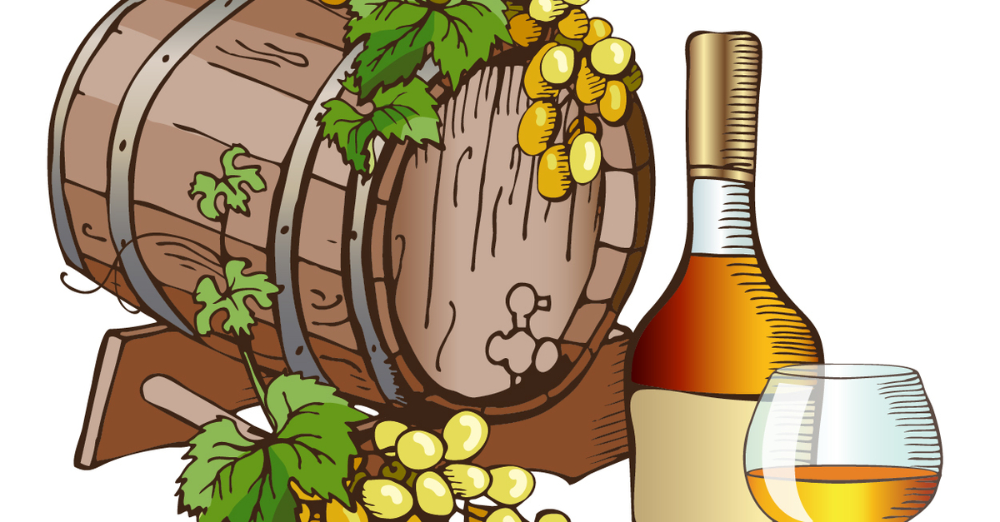

Firstly, this is not another motivational talk or motherhood statement (there are plenty of those out there already), but a metaphor about resourcefulness.

We have all heard the adage “when life gives you lemons, make lemonade”. Allow me to present a slight twist (pardon the pun…) on this statement.

Cognac is a variety of brandy named after the town of Cognac, France. It is distilled from a white wine grown from grapes in the area. The wine used to make Cognac is characterised as "virtually undrinkable". However in its distilled form, Cognac is considered to be the world's most refined spirit. With bottles of high end Cognac fetching as much as $200,000.

The area surrounding the town of Cognac was a recognised wine-growing area dating back to the third century, however when it was evident that the grapes produced in the town of Cognac itself were unsuitable for wine making, local producers developed the practice of double distillation in copper pot stills and ageing in oak barrels for at least two years. The product yielded was the spirit we now know as Cognac.

Fast forward 15 centuries to Scotland in the 1800’s, where John Walker was a humble shopkeeper. Local whiskey producers would bring John different varieties of single malt whiskeys, many of them below an acceptable standard. Instead of on selling these varieties – he began blending them as made-to-order whiskies, blended to meet specific customer requirements. From this idea a product (and subsequently one of the most globally recognised brands) was created which would last over 200 years.

**Interesting, but what does this have to do with technology you might ask?**

Ingenuity and resourcefulness have existed for as long as man has, but in the realm of technology and in particular cloud computing and open source software it has never been more imperative. We are continually faced with challenges on each assignment or project, often technology not working as planned or as advertised, or finding dead ends when trying to solve problems. This is particularly evident now as software and technology are moving at such an accelerated rate.

To be successful in this era you need creativity and lateral thinking. You need an ability not just to solve problems to which there are no documented solutions, but to create new products from existing ones which are not necessarily suitable for your specific objective. In many cases, looking to add value in the process. That is not just making lemonade from lemons (which anyone could think of) but making Cognac from sub-standard grapes or premium blended whiskey from sub-standard single malt whiskies.

One of my favourite Amazon Leadership Principles is **_“Invent and Simplify”_**:

> *Leaders expect and require innovation and invention from their teams and always find ways to simplify. They are externally aware, look for new ideas from everywhere, and are not limited by “not invented here". As we do new things, we accept that we may be misunderstood for long periods of time.*
> 
> [_**https:**_**//www.amazon.jobs/en/principles**](https://www.amazon.jobs/en/principles)  

The intent in this statement is not simply to “lift and shift” current on premise systems and processes to the cloud, but to look for ways to streamline, rationalise and simplify processes in doing so. This mandates a combination of practicality and creativity.

The take away is when you are presented with a challenge, be creative and inventive and not just solve the problem but look for ways to add value in the process.

Cheers!
