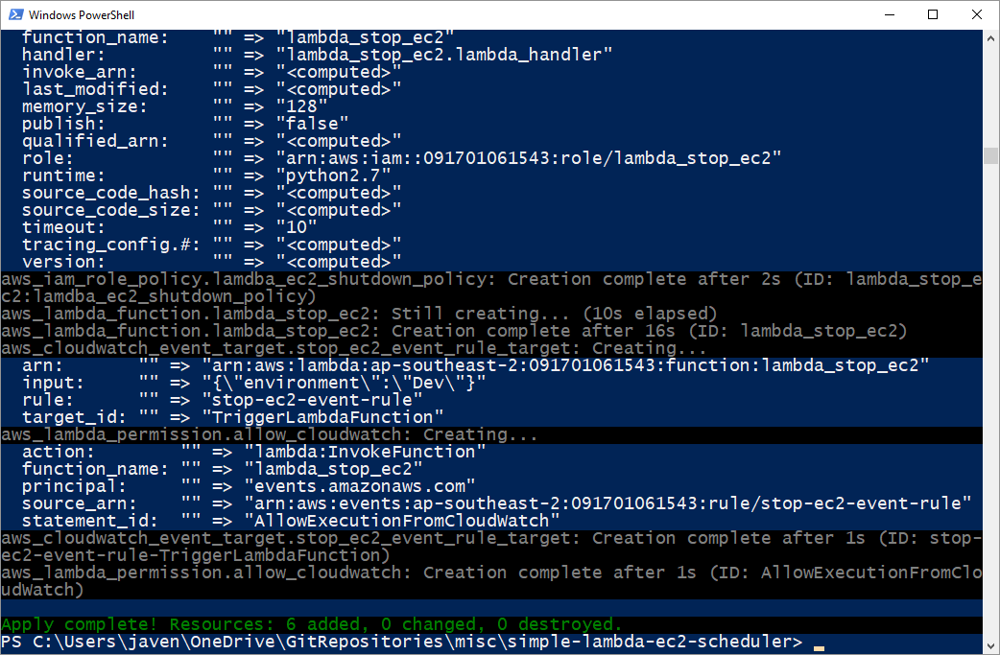

import Gist from 'react-gist';

There are many other blog posts and examples available for either scheduling infrastructure tasks such as the starting or stopping of EC2 instances; or deploying a Lambda function using Terraform. However, I have found many of the other examples to be unnecessarily complicated, so I have put together a very simple example doing both.

The function itself could be easily adapted to take other actions including interacting with other AWS services using the boto3 library (the Python AWS SDK). The data payload could be modified to pass different data to the function as well.

The script only requires input variables for **_schedule\_expression_** (cron schedule based upon GMT for triggering the function – could also be expressed as a rate, e.g. **_rate(5 minutes))_** and **_environment_** (value passed to the function on each invocation). In this example the Input data is the value for the “Environment” key for an EC2 instance tag – a user defined tag to associate the instance to a particular environment (e.g. Dev, Test. Prod). The key could be changed as required, for instance if you wanted to stop instances based upon their given name or part thereof you could change the tag key to be “Name”.

When triggered, the function will stop all running EC2 instances with the given Environment tag.

The Terraform script creates:

- an IAM Role and associated policy for the Lambda Function
- the Lambda function
- a Cloudwatch event rule and trigger

The IAM role and policies required for the Lambda function are deployed as shown here:

<Gist id="6b8ed7c149a60e823361ee282615b826" 
/>

The function source code is packaged into a ZIP archive and deployed using Terraform as follows:

<Gist id="ca6a26a62302ff809eae028bbfb28b41" 
/>

Admittedly Terraform is an infrastructure automation tool and not a build/packaging tool (such as Jenkins, etc), but in this case the packaging only involves zipping up the function source code, so Terraform can be used as a ‘one stop shop’ to keep things simple.

The Cloudwatch schedule trigger is deployed as follows:

<Gist id="7920fda821eb4f03d8ba942da572180c" 
/>

Use the following commands to run this example (I have created a default credentials profile, but you could supply your API credentials directly, use STS, etc):

```
cd simple-lambda-ec2-scheduler
terraform init
terraform apply
```



> *Full source code can be found at: [__https://github.com/avensolutions/simple-lambda-ec2-scheduler__](https://github.com/avensolutions/simple-lambda-ec2-scheduler)*

Stay tuned for more simple Terraform deployment recipes in coming posts…
