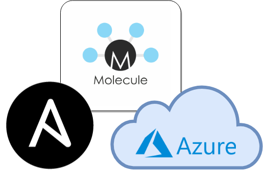

import Gist from 'react-gist';

A few years back, before the rise of the hyper-scalers, I had my first infracode 'aha moment' with OpenStack. The second came with [Kitchen](https://kitchen.ci/).

I had already been using test driven development for application code and configuration automation for infrastructure but Kitchen brought the two together. Kitchen made it possible to write tests, spin up infrastructure, and then tear everything down again - the Red/Green/Refactor cycle for infrastructure. What made this even better was that it wasn't a facsimile of a target environment, it was the same - same VM's, same OS, same network.

Coming from a Chef background for configuration automation, Kitchen is a great fit to the Ruby ecosystem. Kitchen works with Ansible and Azure, but a Ruby environment and at least a smattering of Ruby coding skills are required.

[Molecule](https://molecule.readthedocs.io/) provides a similar red-green development cycle to Kitchen, but without the need to step outside of the familiar Python environment.

Out of the box, Molecule supports development of Ansible roles using either a Docker or Virtual Box infrastructure provider. Molecule also leverages the Ansible drivers for private and public cloud platforms.

Molecule can be configured to test an individual role or collections of roles in Ansible playbooks.

This tutorial demonstrates how to use Molecule with Azure to develop and test an individual Ansible role following the red/green/refactor infracode workflow, which can be generalised as:

- **Red**\- write a failing infrastructure test
- **Green** - write the Ansible tasks needed to pass the test
- Refactor - repeat the process

The steps required for this tutorial are as follows:

## Azure setup

Ensure there is an existing Azure Resource Group that will be used for infracode development and testing. Within the resource group, ensure there is a single virtual network (vnet) with a single subnet. Ansible will use these for the default network setup.

## Setup a working environment

There are a number of options for setting up a Python environment for Ansible and Molecule, including Python virtualenv or a Docker container environment.

## Create a Docker image for Ansible+Molecule+Azure

This tutorial uses a Docker container environment. A `Dockerfile` for the image can be found in `./molecule-azure-image/Dockerfile`. The image sets up a sane Python3 environment with Ansible, Ansible\[azure\], and Molecule `pip` modules installed.

<Gist id="4bd0c2ccae06dcaedffc2d91e594145f" 
/>

## Create a Docker workspace

Setup a working environment using the Docker image with Ansible, Molecule, and the `azure-cli` installed.

<Gist id="f80ef20a720914cfd4e02cf9783fec06" 
/>

This example assumes the following:

- a resource group already exists with access rights to create virtual machines; and
- the resource group contains a single vnet with a single subnet

## Log into an Azure subcription

Ansible supports a number of different methods for authenticating with Azure. This example uses the `azure-cli` to login interactively.

<Gist id="fd8987e7f724de5393a411c24c74978b" 
/>

## Create an empty Ansible role with Molecule

Molecule provides an `init` function with defaults for various providers. The molecule-azure-role-template creates an empty role with scaffolding for Azure.

<Gist id="f9b301d950a2254ab9af4806f2110544" 
/>

Check that the environment is working by running the following code:

<Gist id="d56c3cd1e25b51acc634e5adb8a0a256" 
/>

The output should look be similar to…

<Gist id="a3f8aed99a7c910588a5651d8cabf0e8" 
/>

## Spin up an Azure VM

Spin up a fresh VM to be used for infra-code development.

<Gist id="14a621ee65f9c2db583ed5ef94274c71" 
/>

Molecule provides a handy option for logging into the new VM:

<Gist id="456aa8a8860bf785b382e18ede204d33" 
/>

There is now a fresh Ubuntu 18.04 virtual machine ready for infra-code development. For this example, a basic Nginx server will be installed and verified.

## Write a failing test

[Testinfra](https://testinfra.readthedocs.io/en/latest/) provides a `pytest` based framework for verifying server and infrastructure configuration. Molecule then manages the execution of those `testinfra` tests. The Molecule template provides a starting point for crafting tests of your own. For this tutorial, installation of the `nginx` service is verified. Modify the tests file using `vi molecule/default/tests/test_default.py`

<Gist id="5b22b20a192aecbecb8cc229cb5f2a69" 
/>

## Execute the failing test

The Ansible task needed to install and enable `nginx` has not yet been written, so the test should fail:

<Gist id="38eb4bb776a41db7aa68f5962a97af62" 
/>

If the initial sample tests in `test_default.py` are kept, then 3 tests should fail and 2 tests should pass.

## Write a task to install `nginx`

Add a task to install the `nginx` service using `vi tasks/main.yml`:

<Gist id="40d884f0c3a39fc4b3e921d451d60358" 
/>

## Apply the role

Apply the role to the instance created using Molecule.

<Gist id="5787aee41e2e3e9373f656677567ae41" 
/>

The `nginx` package should now be installed, both enabled and started, and listening on port 80. Note that the `nginx` instance will not be accessible from the Internet due to the Azure network security rules. The `nginx` instance can be confirmed manually by logging into the instance and using `curl` to make a request to the `nginx` service.

<Gist id="fb02518e7129bf28e27822c42221f706" 
/>

## Execute the passing test

After applying the Ansible task to the instance, the `testinfra` tests should now pass.

<Gist id="b6359519ca6068615f8f1473636f90ea" 
/>

## Cleanup

Now that the Ansible role works as defined in the test specification, the development environment can be cleaned up.

<Gist id="150971a02b3f4b2c65d551cb09a203d0" 
/>

Molecule removes the Azure resources created to develop and test the configuration role. Note that deletion may take a few minutes.

Finally, once you are done, exit the container environment. If the container was started with the `--rm` switch, the container will also be removed, leaving you with a clean workspace and newly minted Ansible role with automated test cases.

<Gist id="4fbb00b116b1a389b0343f6424b19a1b" 
/>
