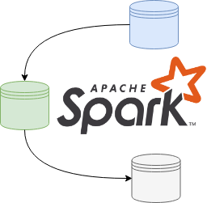

import Gist from 'react-gist';

Change Data Capture (CDC) is one of the most challenging processing patterns to implement at scale. I personally have had several cracks at this using various different frameworks and approaches, the most recent of which was implemented using Spark – and I think I have finally found the best approach. Even though the code examples referenced use Spark, the pattern is language agnostic – the focus is on the approach not the specific implementation (as this could be applied to any framework or runtime).

:::note Spark Training Courses

[Data Transformation and Analysis Using Apache Spark](https://academy.alphazetta.ai/data-transformation-and-analysis-using-apache-spark/)  
[Stream and Event Processing using Apache Spark](https://academy.alphazetta.ai/stream-and-event-processing-using-apache-spark/)  
[Advanced Analytics Using Apache Spark](https://academy.alphazetta.ai/advanced-analytics-using-apache-spark/)

:::

The first challenge you are faced with, is to compare a very large dataset (representing the current state of an object) with another potentially very large dataset (representing new or incoming data). Ideally, you would like the process to be configuration driven and accommodate such things as composite primary keys, or operational columns which you would like to restrict from change detection. You may also want to implement a pattern to segregate sensitive attributes from non-sensitive attributes.

## Overview

This pattern (and all my other recent attempts) is fundamentally based upon calculating a deterministic hash of the key and non-key attribute(s), and then using this hash as the basis for comparison. The difference between this pattern and my other attempts is in the distillation and reconstitution of data during the process, as well as breaking the pattern into discrete stages (designed to minimize the impact to other applications). This pattern can be used to process delta or full datasets.

A high-level flowchart representing the basic pattern is shown here:

## The Example

The example provided uses the [Synthetic CDC Data Generator application](https://github.com/avensolutions/synthetic-cdc-data-generator), configuring an incoming set with 5 uuid columns acting as a composite key, and 10 random number columns acting as non key values. The initial days payload consists of 10,000 records, the subsequent days payload consists of another 10,000 records. From the initial dataset, a `DELETE` operation was performed at the source system for 20% of records, an `UPDATE` was performed on 40% of the records and the remaining 40% of records were unchanged. In this case the 20% of records that were deleted at the source, were replaced by new `INSERT` operations creating new keys.

After creating the synthesized day 1 and day 2 datasets, the files are processed as follows:

$ spark-submit cdc.py config.yaml data/day1 2019-06-18  
$ spark-submit cdc.py config.yaml data/day2 2019-06-19

Where `config.yaml` is the configuration for the dataset, data/day1 and data/day2 represent the different data files, and 2019-06-18 and 2019-06-19 represent a business effective date.

## The Results

You should see the following output from running the preceding commands for day 1 and day 2 respectively:

### Day 1:

<Gist id="b75edc7825b46c12b328d78d47b4b902" 
/>

### Day 2:

<Gist id="ca92e132105fb5bb381bf9dfca562bf4" 
/>

A summary analysis of the resultant dataset should show:

<Gist id="ded1f98dc4fce13c9bb3d12a51a46b94" 
/>

## Pattern Details

Details about the pattern and its implementation follow.

### Current and Historical Datasets

The output of each operation will yield a current dataset (that is the current stateful representation of a give object) and a historical dataset partition (capturing the net changes from the previous state in an appended partition).

This is useful, because often consumers will primarily query the latest state of an object. The change sets (or historical dataset partitions) can be used for more advanced analysis by sophisticated users.

### Type 2 SCDs (sort of)

Two operational columns are added to each current and historical object:

- `OPERATION` : Represents the last known operation to the record, valid values include :
    - `I` (`INSERT`)
    - `U` (`UPDATE`)
    - `D` (`DELETE` – hard `DELETE`s, applies to full datasets only)
    - `X` (Not supplied, applies to delta processing only)
    - `N` (No change)
- `EFF_START_DATE`

Since data structures on most big data or cloud storage platforms are immutable, we only store the effective start date for each record, this is changed as needed with each coarse-grained operation on the current object. The effective end date is inferred by the presence of a new effective start date (or change in the `EFF_START_DATE` value for a given record).

### The Configuration

I am using a YAML document to store the configuration for the pattern. Important attributes to include in your configuration are a list of keys and non keys and their datatype (this implementation does type casting as well). Other important attributes include the table names and file paths for the current and historical data structures.

The configuration is read at the beginning of a routine as an input along with the path of an incoming data file (a CSV file in this case) and a business effective date (which will be used as the `EFF_START_DATE` for new or updated records).

Processing is performed using the specified key and non key attributes and the output datasets (current and historical) are written to columnar storage files (parquet in this case). This is designed to make subsequent access and processing more efficient.

### The Algorithm

I have broken the process into stages as follows:

#### Stage 1 – Type Cast and Hash Incoming Data

The first step is to create deterministic hashes of the configured key and non key values for incoming data. The hashes are calculated based upon a list of elements representing the key and non key values using the MD5 algorithm. The hashes for each record are then stored with the respective record. Furthermore, the fields are casted their target datatype as specified in the configuration. Both of these operations can be performed in a single pass of each row using a `map()` operation.

Importantly we only calculate hashes once upon arrival of new data, as the hashes are persisted for the life of the data – and the data structures are immutable – the hashes should never change or be invalidated.

#### Stage 2 – Determine INSERTs

We now compare Incoming Hashes with previously calculated hash values for the (previous day’s) current object. If no current object exists for the dataset, then it can be assumed this is a first run. In this case every record is considered as an `INSERT` with an `EFF_START_DATE` of the business effective date supplied.

If there is a current object, then the key and non key hash values (only the hash values) are read from the current object. These are then compared to the respective hashes of the incoming data (which should still be in memory).

Given the full outer join:

incoming\_data(keyhash, nonkeyhash) 
FULL OUTER JOIN  
current\_data(keyhash, nonkeyhash) 
ON keyhash

Keys which exist in the left entity which do not exist in the right entity must be the results of an INSERT operation.

Tag these records with an operation of `I` with an `EFF_START_DATE` of the business effective date, then rejoin only these records with their full attribute payload from the incoming dataset. Finally, write out these records to the current and historical partition in `overwrite` mode.

#### Stage 3 - Determine DELETEs or Missing Records

Referring the previous full outer join operation, keys which exist in the right entity (current object) which do not appear in the left entity (incoming data) will be the result of a (hard) `DELETE` operation if you are processing full snapshots, otherwise if you are processing deltas these would be missing records (possibly because there were no changes at the source).

Tag these records as `D` or `X` respectively with an `EFF_START_DATE` of the business effective date, rejoin these records with their full attribute payload from the current dataset, then write out these records to the current and historical partition in `append` mode.

#### Stage 4 - Determine UPDATEs or Unchanged Records

Again, referring to the previous full outer join, keys which exist in both the incoming and current datasets must be either the result of an `UPDATE` or they could be unchanged. To determine which case they fall under, compare the non key hashes. If the non key hashes differ, it must have been a result of an `UPDATE` operation at the source, otherwise the record would be unchanged.

Tag these records as `U` or `N` respectively with an `EFF_START_DATE` of the business effective date (in the case of an update - otherwise maintain the current `EFF_START_DATE`), rejoin these records with their full attribute payload from the incoming dataset, then write out these records to the current and historical partition in `append` mode.

### Key Callouts

A summary of the key callouts from this pattern are:

- Use the RDD API for iterative record operations (such as type casting and hashing)
- Persist hashes with the records
- Use Dataframes for `JOIN` operations
- Only perform `JOIN`s with the `keyhash` and `nonkeyhash` columns – this minimizes the amount of data shuffled across the network
- Write output data in columnar (Parquet) format
- Break the routine into stages, covering each operation, culminating with a `saveAsParquet()` action – this may seem expensive but for large datsets it is more efficient to break down DAGs for each operation
- Use caching for objects which will be reused between actions

#### Metastore Integration

Although I did not include this in my example, you could easily integrate this pattern with a metastore (such as a Hive metastore or AWS Glue Catalog), by using table objects and `ALTER TABLE` statements to add historical partitions.

#### Further optimisations

If the incoming data is known to be relatively small (in the case of delta processing for instance), you could consider a broadcast join where the smaller incoming data is distributed to all of the different Executors hosting partitions from the current dataset.

Also you could add a key to the column config to configure a column to be nullable or not.

Happy CDCing!

> Full source code for this article can be found at: [https://github.com/avensolutions/cdc-at-scale-using-spark](https://github.com/avensolutions/cdc-at-scale-using-spark)

> if you have enjoyed this post, please consider [__buying me a coffee ☕__](https://www.buymeacoffee.com/jeffreyaven) to help me keep writing!