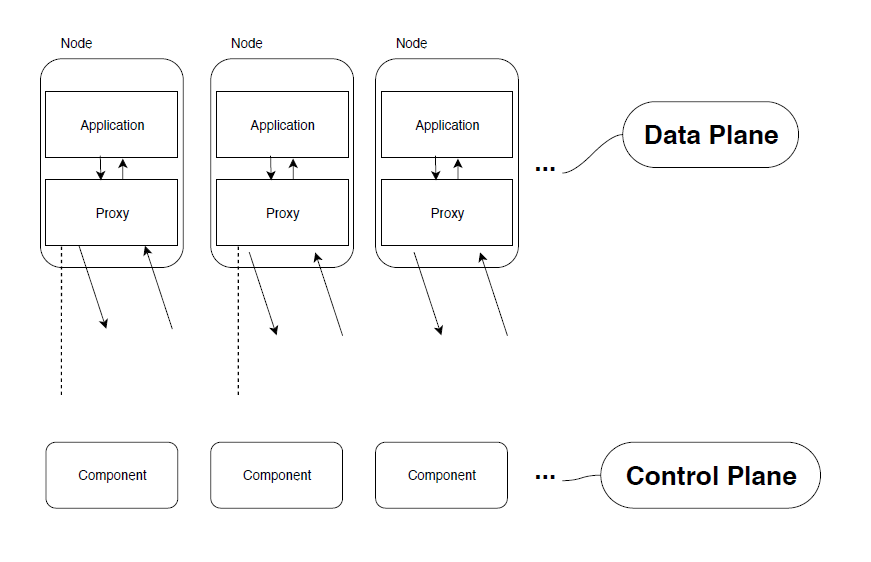

So you’ve started delivering a new project and it’s all about this “Cloud Native” or “Microservices” thing. You’re a Delivery Manager or Software Engineer at some type of company and someone has lightly peppered a meeting with a term, ‘Mesh’.

They possibly said event mesh. Or better yet, they mentioned a service mesh. As time went on you kept hearing more and more about the service mesh. You’ve attempted to read up about it, digested a whole bunch of new terms and still didn’t completely understand what the Mesh even does, why you would need it or why the hype train around this technology shows no sign of stopping. This article is an attempt to provide a focused guide to the service mesh, and why it is so interesting.

## Ok, so what is this thing?

Truth be told, the service mesh is actually pretty simple. It’s built around the idea of small, repeatable bits of software, in this case userspace proxies, stuck very close to your services. This is called the **_data plane_**. In addition to the userspace proxies, you also get a bunch of management processes, which is referred to as the **_control plane_**. Simply put, the data plane (userspace proxies) intercepts all calls between services and the control plane (management processes) coordinates the wholesale behaviour of those proxies. This allows you to perform sweeping changes across your service landscape via the control planes API’s, operators and provides the capability to measure your mesh as a whole.

Before we get into the engineering of what the proxies are, let’s go with an example.

- The business has bought some software.
- The engineers are tasked with deploying this software in their Kubernetes cluster.
- The engineers first task is to containerise this application, expose its functionality to downstream applications and deploy it to the cluster in a repeatable, continuous fashion.
- There’s a requirement in your organisation that says ‘I need all communications to this vendors software as TLS1.3’. Or, ‘I would like to measure all API latency from this application’.

The engineer replies ‘I can’t make changes to a third party application! What do I do?’. Service mesh to the rescue.

Using a service mesh, you can deploy a proxy right next to your vendor container and in effect, abstract away the complexities of measurement and data transport mechanisms, and allow the vendor software to concentrate on it’s business logic.

This vendor container is now part of the **_service mesh_**.

## Proxies

When we talk about proxies, we usually discuss things in OSI model terminology, that is to say Layers 1 through 7. Most of the time when it comes to proxies, you’re comparing Layer 4 to Layer 7. Here’s a quick run-down:

Layer 4 (L4) -> operates with the delivery of messages with no regard to the content of the messages. They would simply forward network packets to and from the server without inspecting any part of the packets.

Layer 7 (L7) -> this is a higher level, application layer. This deals with the actual content of the message. If you were routing network traffic, you could do this at L7 in a much more sophisticated way because you can now make decisions based on the packets messages within.

Why pick between L4 and L7? _Speed_.

Back to the service mesh, these userspace proxies are L7-aware TCP proxies. Think _**NGINX**_ or _**haproxy**_. There are different proxies; [Linkerd](https://linkerd.io/) is an ultralight service mesh for Kubernetes. The most popular is [Envoy](https://www.envoyproxy.io/), which was created by the ride-share company Lyft. Above, I also mentioned NGINX and haproxy which are also quite popular. So what differentiates NGINX proxies from the service mesh? Their _focus_. You would implement NGINX as an Ingress proxy (traffic entering your network), but when it comes to proxies that focus on traffic between services, that’s when the service mesh proxy comes in to play.

Ok, probably time for a diagram now that we’ve explained the Data Plane.

Tune in for part 2 for when we discuss the Control Plane!
