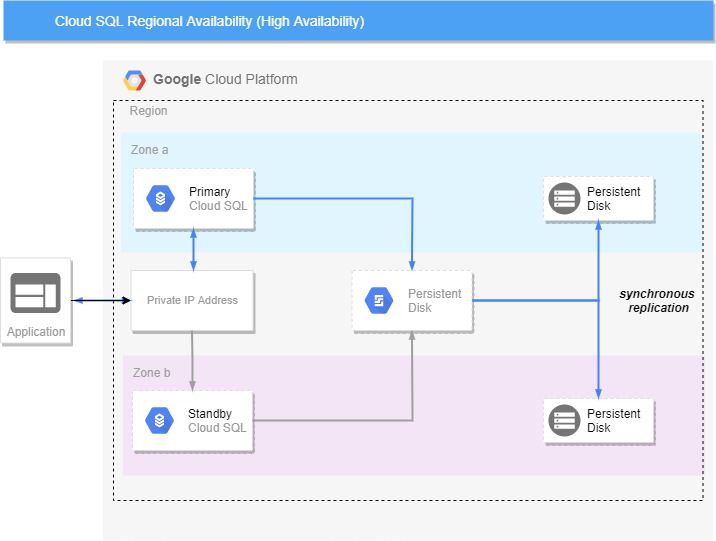
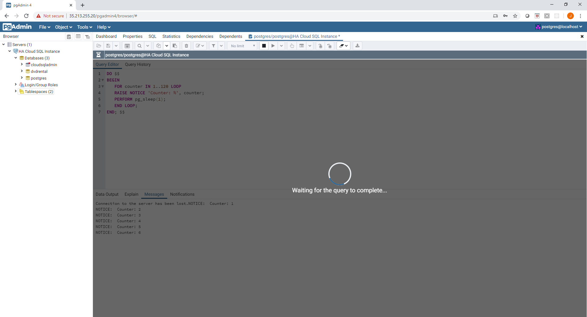
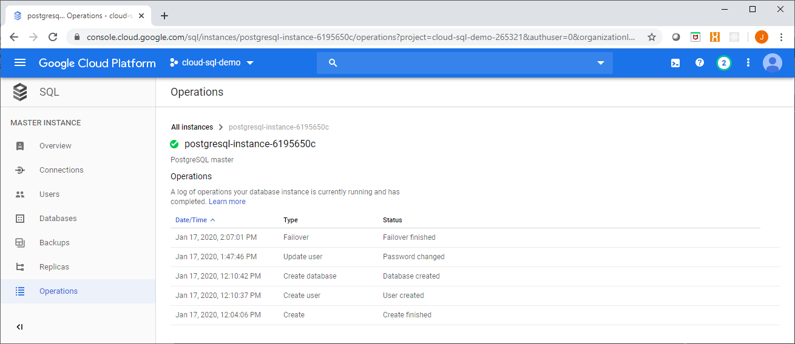

In this multi part blog we will explore the features available in Google Cloud SQL for High Availability, Backup and Recovery, Replication and Failover and Security (at rest and in transit) for the PostgreSQL DBMS engine. Some of these features are relatively hot of the press and in Beta – which still makes them available for general use.

We will start by looking at the High Availability (HA) options available to you when using the PostgreSQL engine in Google Cloud SQL.

Most of you would be familiar with the concepts of High Availability, Redundancy, Fault Tolerance, etc but let’s start with a definition of HA anyway:

> High availability (HA) is a characteristic of a system, which aims to ensure an agreed level of operational performance, usually uptime, for a higher than normal period.
> 
> Wikipedia

Higher than a normal period is quite subjective, typically this is quantified by a percentage represented by a number of “9s”, that is 99.99% (which would be quoted as “four nines”), this would allot you 52.60 minutes of downtime over a one-year period.

Essentially the number of 9’s required will drive your bias towards the options available to you for Cloud SQL HA.

We will start with Cloud SQL HA in its simplest form, Regional Availability.

## Regional Availability

Knowing what we know about the Google Cloud Platform, regional availability means that our application or service (in this case Cloud SQL) should be resilient to a failure of any one zone in our region. In fact, as all GCP regions have at least 3 zones – two zones could fail, and our application would still be available.

Regional availability for Cloud SQL (which Google refers to as High Availability), creates a standby instance in addition to the primary instance and uses a regional Persistent Disk resource to store the database instance data, transaction log and other state files, which is synchronously replicated to a Persistent Disk resource local to the zones that the primary and standby instances are located in.

A shared IP address (like a Virtual IP) is used to serve traffic to the healthy (normally primary) Cloud SQL instance.

An overview of Cloud SQL HA is shown here:

[](images/cloud-sql-ha.png)

## Implementing High Availability for Cloud SQL

Implementing Regional Availability for Cloud SQL is dead simple, it is one argument:

```
availability_type = "REGIONAL"
```

Using the `gcloud` command line utility, this would be:

```
gcloud sql instances create postgresql-instance-1234 \
  --availability-type=REGIONAL \
  --database-version= POSTGRES_9_6
```

Using Terraform (with a complete set of options) it would look like:

```
resource "google_sql_database_instance" "postgres_ha" {
  provider = google-beta
  region = var.region
  project = var.project
  name = "postgresql-instance-${random_id.instance_suffix.hex}"
  database_version = "POSTGRES_9_6"
  settings {
   tier = var.tier
   disk_size = var.disk_size
   activation_policy = "ALWAYS"
   disk_autoresize = true
   disk_type = "PD_SSD"
   **availability_type = "REGIONAL"**
   backup_configuration {
     enabled = true
     start_time = "00:00"
   }
   ip_configuration  {
     ipv4_enabled = false
     private_network = google_compute_network.private_network.self_link
   }
   maintenance_window  {
     day = 7
     hour = 0
     update_track = "stable"
   }
  }
 } 
```

Once deployed you will notice a few different items in the console, first from the instance overview page you can see that the High Availability option is `ENABLED` for your instance.

[](images/cloud-sql-ha-1.png)

Second, you will see a Failover button enabled on the detailed management view for this instance.

[](images/cloud-sql-ha-2.png)

## Failover

Failovers and failbacks can be initiated manually or automatically (should the primary be unresponsive). A manual failover can be invoked by executing the command:

```
gcloud sql instances failover postgresql-instance-1234
```

There is an `--async` option which will return immediately, invoking the failover operation asynchronously.

Failover can also be invoked from the Cloud Console using the Failover button shown previously. As an example I have created a connection to a regionally available Cloud SQL instance and started a command which runs a loop and prints out a counter:

[](images/cloud-sql-ha-3.png)

Now using the `gcloud` command shown earlier, I have invoked a manual failover of the Cloud SQL instance.

Once the failover is initiated, the client connection is dropped (as the server is momentarily unavailable):

[](images/cloud-sql-ha-4.png)

The connection can be immediately re-established afterwards, the state of the running query is lost - **_importantly no data is lost_** however. If your application clients had retry logic in their code and they weren't executing a long running query, chances are no one would notice! Once reconnecting normal database activities can be resumed:

[](images/cloud-sql-ha-5.png)

A quick check of the instance logs will show that the failover event has occured:

[](images/cloud-sql-ha-6.png)

Now when you return to the instance page in the console you will see a Failback button, which indicates that your instance is being served by the standby:

[](images/cloud-sql-ha-7.png)

Note that there may be a slight delay in the availability of this option as the replica is still being synched.

It is worth noting that nothing comes for free! When you run in REGIONAL or High Availability mode - you are effectively paying double the costs as compared to running in ZONAL mode. However availability and cost have always been trade-offs against one another - you get what you pay for...

> More information can be found at: [https://cloud.google.com/sql/docs/postgres/high-availability](https://cloud.google.com/sql/docs/postgres/high-availability)

Next up we will look at read replicas (and their ability to be promoted) as another high availability alternative in Cloud SQL.
