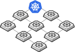

This is a follow up to the previous post:

[__Sick of hearing about Service Mesh? Here’s what you need to know...__](https://cloudywithachanceofbigdata.com/sick-of-hearing-about-service-mesh-heres-what-you-need-to-know/)

## Refresher

A refresher on the data plane, and what the userspace proxy can perform:

- **Routing:** Given a REST request for `/hello` from the local service instance, where should that request be sent?
- **Load Balancing:** Once routing has done its job, to which upstream service instance should the request be sent? With what timeout? If the request fails, should it be retried?
- **Authorisation and Authentication:** For requests that are incoming, can cryptographic functions determine the authenticity of that requests? Is the called allowed to invoke the requested endpoint?
- **Observability:** Detailed logging, statistics, distributed tracing data so that operators can understand the traffic flow and debug problems as they occur
- **Service Discovery:** What backend/upstream service instances are available?
- **Health Checking:** Are upstream service instances healthy and ready to accept traffic?

The control plane is slightly less complex. For the data plane to act in a coordinated fashion, the control plane gives you the machinery to make that happen. This is the magical part of the service mesh; the control plane takes a set of isolated sidecar proxies and turns them into a distributed system. The control plane in turn provides an API to allow the user to modify and inspect the behaviour of the data plane.

You can see from the diagram below the proxies are right next to the service in the same node. We usually call those 'sidecar' containers.

The diagram above gives you a high level indication of what the service mesh would look like. What if I don't have many services? Then the service mesh probably isn't for you. That's a whole lot of machinery to run a single proxy! Having said this, if your solution is running hundreds or thousands of services, then you're going to require a whole heap of proxies.

So there you have it. The service mesh with its control and data plane. To put it simply, the goal of the control plane is to monitor and set a policy that will eventually be enacted by the data plane.

## Why?

You've taken over a project, and the security team have mandated the use of the service mesh. You've never used it yourself before, and the confusion as to why we need another thing is getting you down. An additional thing next to my container that will add latency? And consume resources? And I have to maintain it?! Why would anyone need or want this?

While there are a few answers to this, the most important answer is something I alluded to in an example in part 1 of this series: this design is a great way to add additional logic into the system. Not only can you add additional logic (to containers possibly outside of your control) but you can do this uniformly across the entire mesh! _The service mesh gives you features that are critical for running software that's uniform across your whole stack_

The set of features that the service mesh can provide include reliability features (Retries, timeouts etc), observability features (latencies, volume etc) and security features (mTLS, access control etc).

## Let's break it down

**Server-side software relies on these critical features** If you're building any type of modern server-side software that's predicated on multiple services, think API's and web-apps, and if you're continually adding features to this in a short timeframe, then all the features listed above become critical for you. Your applications must be reliable, observable and most importantly secure. This is exactly what the service mesh helps you with.

**One view to rule them all** The features mentioned above are language-agnostic, don't care about your framework, who wrote it or any part of your development life cycle. They give you, your team and your company a consistent way to deploy changes across your service landscape

**Decoupled from application code** It's important to have a single place to include application and business logic, and not have the nightmare of managing that in multiple components of your system. The core stewardship of the functionality that the service mesh provides lies at the _platform level_. This includes maintenance, deployments, operation etc. The application can be updated and deployed by developers maintaining the application, and the service mesh can change without the application being involved.

## In short

Yes, while the features of the service mesh could be implemented as application code, this solution would not help in driving uniform features sets across the whole system, which is the value proposition for the service mesh.

_If you're a business-logic developer_, you probably don't need to worry about the service mesh. Keep pumping out that new fangled business logic that makes the software oh-so-usable

_If you're in a platform role_ and most likely using _Kubernetes_, then you should be right on top of the service mesh! That is unless your architecture dictates a monolith. You're going to have a lot of services talking to one another, all tied together with an overarching dependency.

_If you're in a platform role with no Kubernetes_ but a bunch of microservices, you should maybe care a little bit about the service mesh, but without the power of Kubernetes and the ease of deployment it brings, you'll have to weigh up how you intend to manage all those proxies.

I hope you enjoyed this article, please feel free to reach out to me at:

Tom Klimovski  
Principal Consultant, Gamma Data  
[tom.klimovski@gammadata.io](mailto:tom.klimovski@gammadata.io)
