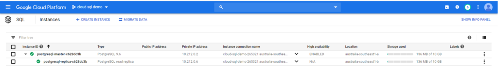
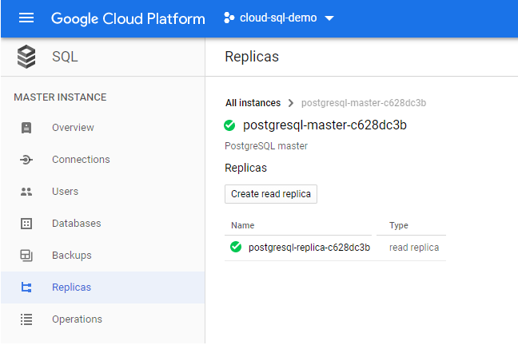
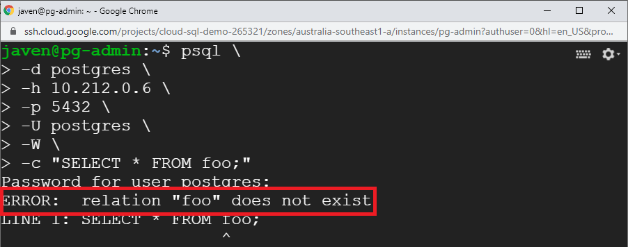
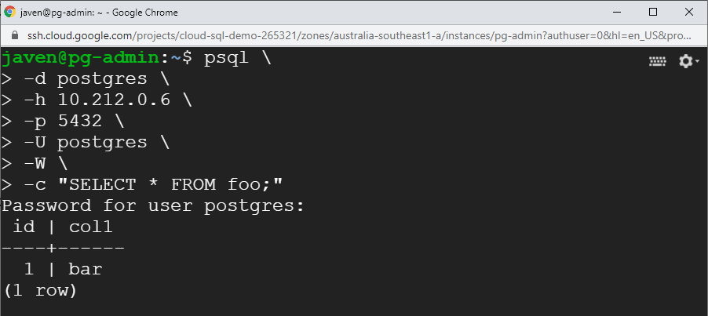

In this post we will look at read replicas as an additional method to achieve multi zone availability for Cloud SQL, which gives us - in turn - the ability to offload (potentially expensive) IO operations such as user created backups or read operations without adding load to the master instance.

In the previous post in this series we looked at Regional availability for PostgreSQL HA using Cloud SQL:

https://cloudywithachanceofbigdata.com/google-cloud-sql-ha-backup-and-recovery-replication-failover-and-security-for-postgresql-part-i/

Recall that this option was simple to implement and worked relatively seamlessly and transparently with respect to zonal failover.

Now let's look at read replicas in Cloud SQL as an additional measure for availability.

## Deploying Read Replica(s)

Deploying read replicas is slightly more involved than simple regional (high) availability, as you will need to define each replica or replicas as a separate Cloud SQL instance which is a slave to the primary instance (the master instance).

An example using Terraform is provided here, starting by creating the master instance:

Next you would specify one or more read replicas (typically in a zone other than the zone the master is in):

Note that several of the options supplied are omitted when creating a read replica database instance, such as the backup and maintenance options - as these operations cannot be performed on a read replica as we will see later.

Cloud SQL Instances - showing master and replica

Cloud SQL Master Instance

Voila! You have just set up a master instance (the primary instance your application and/or users will connect to) along with a read replica in a different zone which will be asynchronously updated as changes occur on the master instance.

## Read Replicas in Action

Now that we have created a read replica, lets see it in action. After connecting to the read replica (like you would any other instance), attempt to access a table that has **_not_** been created on the master as shown here:

SELECT operation from the replica instance

Now create the table and insert some data on the **_master_** instance:

Create a table and insert a record on the master instance

Now try the select operation on the **_replica_** instance:

SELECT operation from the replica instance (after changes have been made on the master)

It works!

## Some Points to Note about Cloud SQL Read Replicas

- Users connect to a read replica as a normal database connection (as shown above)
- Google managed backups (using the console or `gcloud sql backups create ..` ) can **_NOT_** be performed against replica instances
- Read replicas can be used to offload IO intensive operations from the the master instance - such as user managed backup operations (e.g. `pg_dump`)

pg\_dump operation against a replica instance

- **BE CAREFUL** Despite their name, read replicas are **NOT** read only, updates can be made which will NOT propagate back to the master instance - you could get yourself in an awful mess if you allow users to perform `INSERT`, `UPDATE`, `DELETE`, `CREATE` or `DROP` operations against replica instances.

## Promoting a Read Replica

If required a read replica can be promoted to a standalone Cloud SQL instance, which is another DR option. Keep in mind however as the read replica is updated in an asynchronous manner, promotion of a read replica may result in a loss of data (hopefully not much but a loss nonetheless). Your application RPO will dictate if this is acceptable or not.

Promotion of a read replica is reasonably straightforward as demonstrated here using the console:

Promoting a read replica using the console

You can also use the following `gcloud` command:

 gcloud sql instances promote-replica  <replica\_instance\_name>

Once you click on the _Promote Replica_ button you will see the following warning:

_Promoting a read replica using the console_

This simply states that once you promote the replica instance your instance will become an independent instance with no further relationship with the master instance. Once accepted and the promotion process is complete, you can see that you now have two independent Cloud SQL instances (as advertised!):

Promoted Cloud SQL instance

Some of the options you would normally configure with a master instance would need to be configured on the promoted replica instance - such as high availability, maintenance and scheduled backups - but in the event of a zonal failure you would be back up and running with virtually no data loss!

> Full source code for this article is available at: [https://github.com/gamma-data/cloud-sql-postgres-availability-tutorial](https://github.com/gamma-data/cloud-sql-postgres-availability-tutorial)
