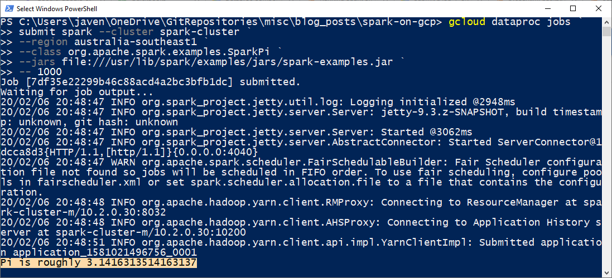
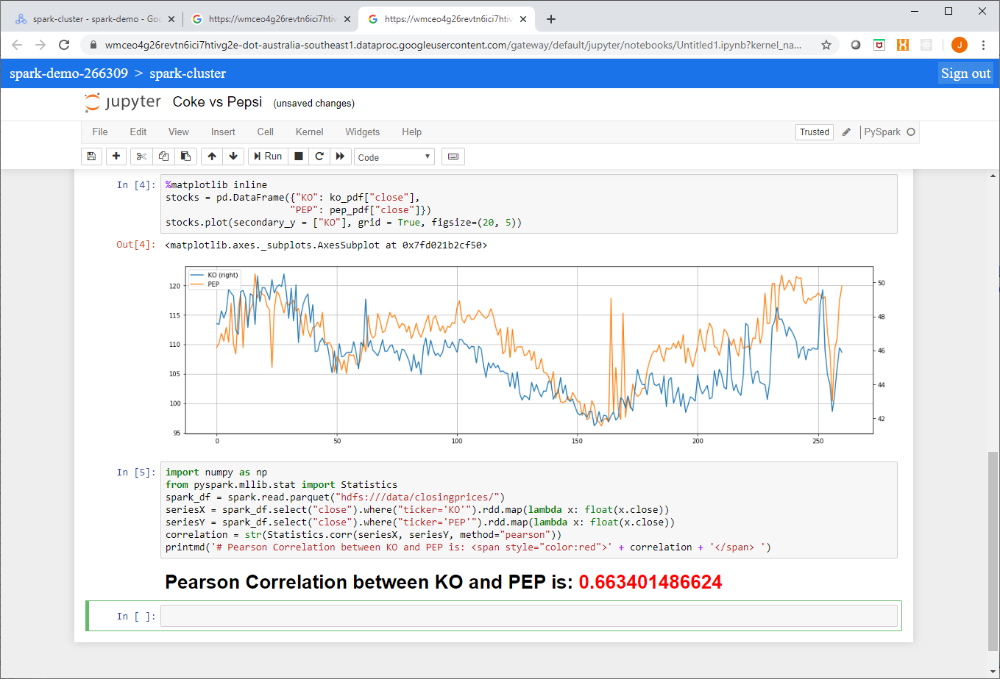

I have been an avid Spark enthusiast since 2014 (the early days..). Spark has featured heavily in every project I have been involved with from data warehousing, ETL, feature extraction, advanced analytics to event processing and IoT applications. I like to think of it as a Swiss army knife for distributed processing.

:::note Spark Training Courses

[Data Transformation and Analysis Using Apache Spark](https://academy.alphazetta.ai/data-transformation-and-analysis-using-apache-spark/)  
[Stream and Event Processing using Apache Spark](https://academy.alphazetta.ai/stream-and-event-processing-using-apache-spark/)  
[Advanced Analytics Using Apache Spark](https://academy.alphazetta.ai/advanced-analytics-using-apache-spark/)

:::

Curiously enough, the first project I had been involved with for some years that did not feature the Apache Spark project was a green field GCP project which got me thinking… where does Spark fit into the GCP landscape?

Unlike the other major providers who use Spark as the backbone of their managed distributed ETL services with examples such as AWS Glue or the Spark integration runtime option in Azure Data Factory, Google’s managed ETL solution is Cloud DataFlow. Cloud DataFlow which is a managed Apache Beam service does not use a Spark runtime (there is a Spark Runner however this is not an option when using CDF). So where does this leave Spark?

My summation is that although Spark is not a first-class citizen in GCP (as far as managed ETL), it is not a second-class citizen either. This article will discuss the various ways Spark clusters and applications can be deployed within the GCP ecosystem.

## Quick Primer on Spark

Every Spark application contains several components regardless of deployment mode, the components in the Spark runtime architecture are:

- the Driver
- the Master
- the Cluster Manager
- the Executor(s), which run on worker nodes or Workers

Each component has a specific role in executing a Spark program and all of the Spark components run in Java virtual machines (JVMs).

[](images/spark-runtime.png)

Cluster Managers schedule and manage distributed resources (compute and memory) across the nodes of the cluster. Cluster Managers available for Spark include:

- Standalone
- YARN (Hadoop)
- Mesos
- Kubernetes

## Spark on DataProc

This is perhaps the simplest and most integrated approach to using Spark in the GCP ecosystem.

DataProc is GCP’s managed Hadoop Service (akin to AWS EMR or HDInsight on Azure). DataProc uses Hadoop/YARN as the Cluster Manager. DataProc clusters can be deployed on a private network (VPC using RFC1918 address space), supports encryption at Rest using Google Managed or Customer Managed Keys in KMS, supports autoscaling and the use of Preemptible Workers, and can be deployed in a HA config.

Furthermore, DataProc clusters can enforce strong authentication using Kerberos which can be integrated into other directory services such as Active Directory through the use of cross realm trusts.

### Deployment

DataProc clusters can be deployed using the `gcloud dataproc clusters create` command or using IaC solutions such as Terraform. For this article I have included an example in the source code using the `gcloud` command to deploy a DataProc cluster on a private network which was created using Terraform.

### Integration

The beauty of DataProc is its native integration into IAM and the GCP service plane. Having been a long-time user of AWS EMR, I have found that the usability and integration are in many ways superior in GCP DataProc. Let’s look at some examples...

#### IAM and IAP (TCP Forwarding)

DataProc is integrated into Cloud IAM using various coarse grained permissions use as `dataproc.clusters.use` and simplified IAM Roles such as `dataproc.editor` or `dataproc.admin`. Members with bindings to the these roles can perform tasks such as submitting jobs and creating workflow templates (which we will discuss shortly), as well as accessing instances such as the master node instance or instances in the cluster using IAP (TCP Forwarding) without requiring a public IP address or a bastion host.

#### DataProc Jobs and Workflows

Spark jobs can be submitted using the console or via `gcloud dataproc jobs submit` as shown here:

[](images/dataproc-spark-job.png)

Cluster logs are natively available in StackDriver and standard out from the Spark Driver is visible from the console as well as via `gcloud` commands.

Complex Workflows can be created by adding Jobs as Steps in Workflow Templates using the following command:

```
gcloud dataproc workflow-templates add-job spark
```

#### Optional Components and the Component Gateway

DataProc provides you with a Hadoop cluster including YARN and HDFS, a Spark runtine – which includes Spark SQL and SparkR. DataProc also supports several optional components including Anaconda, Jupyter, Zeppelin, Druid, Presto, and more.

Web interfaces to some of these components as well as the management interfaces such as the Resource Manager UI or the Spark History Server UI can be accessed through the Component Gateway.

This is a Cloud IAM integrated gateway (much like IAP) which can allow access through an authenticated and authorized console session to web UIs in the cluster – without the need for SSH tunnels, additional firewall rules, bastion hosts, or public IPs. Very cool.

Links to the component UIs as well as built in UIs like the YARN Resource Manager UI are available directly from through the console.

#### Jupyter

Jupyter is a popular notebook application in the data science and analytics communities used for reproducible research. DataProc’s Jupyter component provides a ready-made Spark application vector using PySpark. If you have also installed the Anaconda component you will have access to the full complement of scientific and mathematic Python packages such as Pandas and NumPy which can be used in Jupyter notebooks as well. Using the Component Gateway, Jupyer notebooks can be accessed directly from the Google console as shown here:

[](images/dataproc-jupyter-notebook.png)

From this example you can see that I accessed source data from a GCS bucket and used HDFS as local scratch space.

Furthermore, notebooks are automagically saved in your integrated Cloud Storage DataProc staging bucket and can be shared amongst analysts or accessed at a later time. These notebooks also persist beyond the lifespan of the cluster.

Next up we will look at deploying a Spark Standalone cluster on a GKE cluster, see you then!
