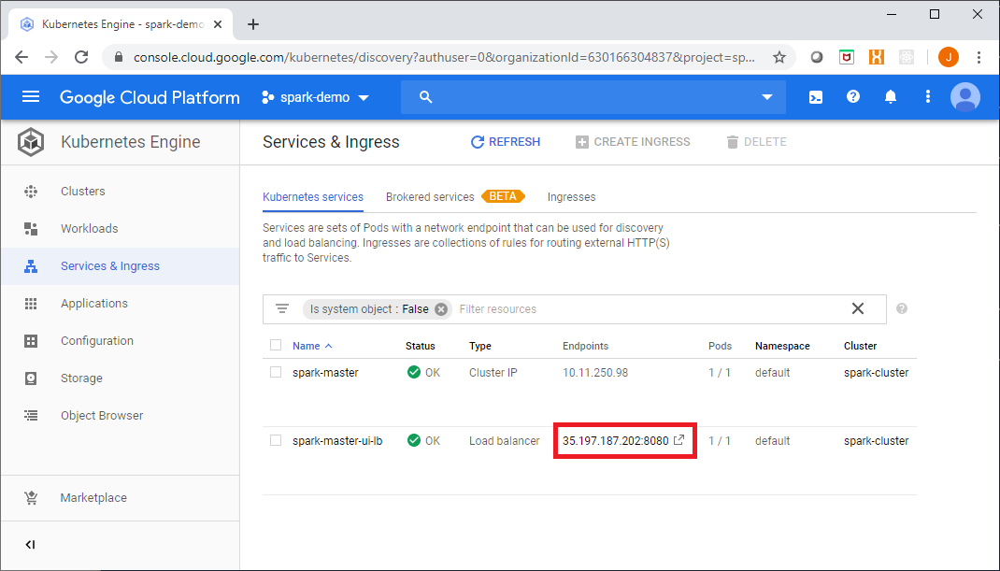

import Gist from 'react-gist';

In the previous post in this series [__Spark in the Google Cloud Platform Part 1__](https://cloudywithachanceofbigdata.com/spark-in-the-google-cloud-platform-part-1/), we started to explore the various ways in which we could deploy Apache Spark applications in GCP. The first option we looked at was deploying Spark using Cloud DataProc, a managed Hadoop cluster with various ecosystem components included.

:::note Spark Training Courses

[Data Transformation and Analysis Using Apache Spark](https://academy.alphazetta.ai/data-transformation-and-analysis-using-apache-spark/)  
[Stream and Event Processing using Apache Spark](https://academy.alphazetta.ai/stream-and-event-processing-using-apache-spark/)  
[Advanced Analytics Using Apache Spark](https://academy.alphazetta.ai/advanced-analytics-using-apache-spark/)

:::

In this post, we will look at another option for deploying Spark in GCP – _a Spark Standalone cluster running on GKE_.

Spark Standalone refers to the in-built cluster manager provided with each Spark release. Standalone can be a bit of a misnomer as it sounds like a single instance – which it is not, standalone simply refers to the fact that it is not dependent upon any other projects or components – such as Apache YARN, Mesos, etc.

A Spark Standalone cluster consists of a Master node or instance and one of more Worker nodes. The Master node serves as both a master and a cluster manager in the Spark runtime architecture.

The Master process is responsible for marshalling resource requests on behalf of applications and monitoring cluster resources.

The Worker nodes host one or many Executor instances which are responsible for carrying out tasks.

Deploying a Spark Standalone cluster on GKE is reasonably straightforward. In the example provided in this post we will set up a private network (VPC), create a GKE cluster, and deploy a Spark Master pod and two Spark Worker pods (in a real scenario you would typically have many Worker pods).

Once the network and GKE cluster have been deployed, the first step is to create Docker images for both the Master and Workers.

The `Dockerfile` below can be used to create an image capable or running either the Worker or Master daemons:

<Gist id="a2828409021205b3f6587c824c59928d" 
/>

Note the shell scripts included in the `Dockerfile`: `spark-master` and `spark-worker`. These will be used later on by K8S deployments to start the relative Master and Worker daemon processes in each of the pods.

Next, we will use Cloud Build to build an image using the `Dockerfile` are store this in GCR (Google Container Registry), from the Cloud Build directory in our project we will run:

```
gcloud builds submit --tag gcr.io/spark-demo-266309/spark-standalone
```

Next, we will create Kubernetes deployments for our Master and Worker pods.

Firstly, we need to get cluster credentials for our GKE cluster named ‘spark-cluster’:

```
gcloud container clusters get-credentials spark-cluster --zone australia-southeast1-a --project spark-demo-266309
```

Now from within the `k8s-deployments\deploy` folder of our project we will use the `kubectl` command to deploy the Master pod, service and the Worker pods

Starting with the Master deployment, this will deploy our Spark Standalone image into a container running the Master daemon process:

<Gist id="31bca11627167e0cd963103e4c7f11d2" 
/>

To deploy the Master, run the following:

```
kubectl create -f spark-master-deployment.yaml
```

The Master will expose a web UI on port 8080 and an RPC service on port 7077, we will need to deploy a K8S service for this, the YAML required to do this is shown here:

<Gist id="a72d3c38d7a3f94e88c7affd28a3034b" 
/>

To deploy the Master service, run the following:

```
kubectl create -f spark-master-service.yaml
```

Now that we have a Master pod and service up and running, we need to deploy our Workers which are preconfigured to communicate with the Master service.

The YAML required to deploy the two Worker pods is shown here:

<Gist id="97ceb93ed35959c41d80fb8c025a7ba1" 
/>

To deploy the Worker pods, run the following:

```
kubectl create -f spark-worker-deployment.yaml
```

You can now inspect the Spark processes running on your GKE cluster.

```
kubectl get deployments
```

Shows...

```
NAME           READY   UP-TO-DATE   AVAILABLE   AGE
 spark-master   1/1     1            1           7m45s
 spark-worker   2/2     2            2           9s
```
```
kubectl get pods
```

Shows...

```
NAME                            READY   STATUS    RESTARTS   AGE
 spark-master-f69d7d9bc-7jgmj    1/1     Running   0          8m
 spark-worker-55965f669c-rm59p   1/1     Running   0          24s
 spark-worker-55965f669c-wsb2f   1/1     Running   0          24s
```
Next, as we need to expose the Web UI for the Master process we will create a _LoadBalancer_ resource. The YAML used to do this is provided here:

<Gist id="56ee86f50f329f99679ff243bb00fb07" 
/>

To deploy the LB, you would run the following:

```
kubectl create -f spark-ui-lb.yaml
```

__NOTE__ This is just an example, for simplicity we are creating an external _LoadBalancer_ with a public IP, this configuration is likely not be appropriate in most real scenarios, alternatives would include an internal _LoadBalancer_, retraction of Authorized Networks, a jump host, SSH tunnelling or IAP.

Now you’re up and running!

You can access the Master web UI from the Google Console link shown here:

[](images/master-ui-link.png)

The Spark Master UI should look like this:

[](images/spark-master-ui.png)

Next we will exec into a Worker pod, get a shell:

```
kubectl exec -it spark-worker-55965f669c-rm59p -- sh
```

Now from within the shell environment of a Worker – which includes all of the Spark client libraries, we will submit a simple Spark application:

```
spark-submit --class org.apache.spark.examples.SparkPi \
 --master spark://10.11.250.98:7077 \
/opt/spark/examples/jars/spark-examples*.jar 10000
```

You can see the results in the shell, as shown here:

[](images/spark-application-example.png)

Additionally, as all of the container logs go to Stackdriver, you can view the application logs there as well:

[](images/container-logs-in-stackdriver.png)

This is a simple way to get a Spark cluster running, it is not without its downsides and shortcomings however, which include the limited security mechanisms available (SASL, network security, shared secrets).

In the final post in this series we will look at Spark on Kubernetes, using Kubernetes as the Spark cluster manager and interacting with Spark using the Kubernetes API and control plane, see you then.

> Full source code for this article is available at: [https://github.com/gamma-data/spark-on-gcp](https://github.com/gamma-data/spark-on-gcp)

The infrastructure coding for this example uses Powershell and Terraform, and is deployed as follows:

```powershell
PS > .\run.ps1 private-network apply <gcp-project> <region>
PS > .\run.ps1 gke apply <gcp-project> <region>
```