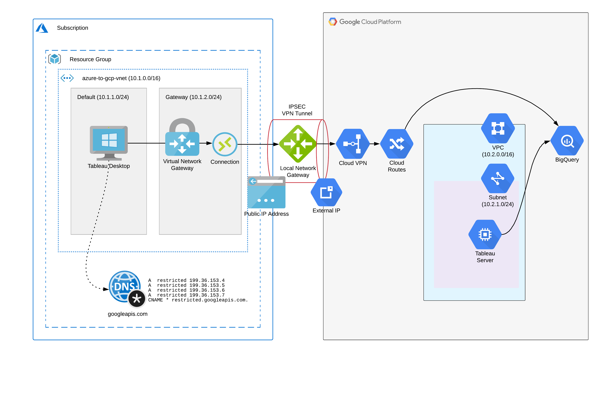

import ImageWithCaption from '/js/ImageWithCaption/ImageWithCaption.js';
import GcpVpnToAzure from './images/gcp-vpn-to-azure.png';
import AzureVpnToGCP from './images/azure-vpn-to-gcp.png';

This article demonstrates creating a site to site IPSEC VPN connection between a GCP VPC network and an Azure Virtual Network, enabling private RFC1918 network connectivity between virtual networks in both clouds. This is done using a single PowerShell script leveraging Azure PowerShell and gcloud commands in the Google SDK.

Additionally, we will use Azure Private DNS to enable private access between Azure hosts and GCP APIs (such as Cloud Storage or Big Query).

An overview of the solution is provided here:

[](images/gcp-to-azure-vpn-design.png)

One note before starting - site to site VPN connections between GCP and Azure currently do not support dynamic routing using BGP, however creating some simple routes on either end of the connection will be enough to get going.

Let’s go through this step by step:

## Step 1 : Authenticate to Azure

Azure’s account equivalent is a subscription, the following command from Azure Powershell is used to authenticate a user to one or more subscriptions.

```powershell
Connect-AzAccount
```

This command will open a browser window prompting you for Microsoft credentials, once authenticated you will be returned to the command line.

## Step 2 : Create a Resource Group (Azure)

A resource group is roughly equivalent to a project in GCP. You will need to supply a Location (equivalent to a GCP region):

```powershell
New-AzResourceGroup `
  -Name "azure-to-gcp" `
  -Location "Australia Southeast"
```

## Step 3 : Create a Virtual Network with Subnets and Routes (Azure)

An Azure Virtual Network is the equivalent of a VPC network in GCP (or AWS), you must define subnets before creating a Virtual Network. In this example we will create two subnets, one Gateway subnet (which needs to be named accordingly) where the VPN gateway will reside, and one subnet named ‘default’ where we will host VMs which will connect to GCP services over the private VPN connection.

Before defining the default subnet we must create and attach a Route Table (equivalent of a Route in GCP), this particular route will be used to route ‘private’ requests to services in GCP (such as Big Query).

```powershell
# define route table and route to GCP private access
$azroutecfg = New-AzRouteConfig `
  -Name "google-private" `
  -AddressPrefix "199.36.153.4/30" `
  -NextHopType "VirtualNetworkGateway" 

$azrttbl = New-AzRouteTable `
  -ResourceGroupName "azure-to-gcp" `
  -Name "google-private" `
  -Location "Australia Southeast" `
  -Route $azroutecfg

# define gateway subnet
$gatewaySubnet = New-AzVirtualNetworkSubnetConfig  `
  -Name "GatewaySubnet" `
  -AddressPrefix "10.1.2.0/24"

# define default subnet
$defaultSubnet  = New-AzVirtualNetworkSubnetConfig `
  -Name "default" `
  -AddressPrefix "10.1.1.0/24" `
  -RouteTable $azrttbl

# create virtual network and subnets
$vnet = New-AzVirtualNetwork  `
  -Name "azure-to-gcp-vnet" `
  -ResourceGroupName "azure-to-gcp" `
  -Location "Australia Southeast" `
  -AddressPrefix "10.1.0.0/16" `
  -Subnet $gatewaySubnet,$defaultSubnet
```

## Step 4 : Create Network Security Groups (Azure)

Network Security Groups in Azure are stateful firewalls much like Firewall Rules in VPC networks in GCP. Like GCP, the lower priority overrides higher priority rules.

In the example we will create several rules to allow inbound ICMP, TCP and UDP traffic from our Google VPC and RDP traffic from the Internet (which we will use to logon to a VM in Azure to test private connectivity between the two clouds):

```powershell
# create network security group
$rule1 = New-AzNetworkSecurityRuleConfig `
  -Name rdp-rule `
  -Description "Allow RDP" `
  -Access Allow `
  -Protocol Tcp `
  -Direction Inbound `
  -Priority 100 `
  -SourceAddressPrefix Internet `
  -SourcePortRange * `
  -DestinationAddressPrefix * `
  -DestinationPortRange 3389

$rule2 = New-AzNetworkSecurityRuleConfig `
  -Name icmp-rule `
  -Description "Allow ICMP" `
  -Access Allow `
  -Protocol Icmp `
  -Direction Inbound `
  -Priority 101 `
  -SourceAddressPrefix * `
  -SourcePortRange * `
  -DestinationAddressPrefix * `
  -DestinationPortRange *

$rule3 = New-AzNetworkSecurityRuleConfig `
  -Name gcp-rule `
  -Description "Allow GCP" `
  -Access Allow `
  -Protocol Tcp `
  -Direction Inbound `
  -Priority 102 `
  -SourceAddressPrefix "10.2.0.0/16" `
  -SourcePortRange * `
  -DestinationAddressPrefix * `
  -DestinationPortRange *

$nsg = New-AzNetworkSecurityGroup `
  -ResourceGroupName "azure-to-gcp" `
  -Location "Australia Southeast" `
  -Name "nsg-vm" `
  -SecurityRules $rule1,$rule2,$rule3
```

## Step 5 : Create Public IP Addresses (Azure)

We need to create two Public IP Address (equivalent of an External IP in GCP) which will be used for our VPN gateway and for the VM we will create:

```powershell
# create public IP address for VM
$vmpip = New-AzPublicIpAddress `
  -Name "vm-ip" `
  -ResourceGroupName "azure-to-gcp" `
  -Location "Australia Southeast" `
  -AllocationMethod Dynamic

# create public IP address for NW gateway 
$ngwpip = New-AzPublicIpAddress `
  -Name "ngw-ip" `
  -ResourceGroupName "azure-to-gcp" `
  -Location "Australia Southeast" `
  -AllocationMethod Dynamic
```

## Step 6 : Create Virtual Network Gateway (Azure)

The Virtual Network Gateway in Azure is the VPN Gateway equivalent in Azure which will be used to create a VPN tunnel between Azure and a GCP VPN Gateway. This gateway will be placed in the Gateway subnet created previously and one of the Public IP addresses created in the previous step will be assigned to this gateway.

```powershell
# create virtual network gateway
$ngwipconfig = New-AzVirtualNetworkGatewayIpConfig `
  -Name "ngw-ipconfig" `
  -SubnetId $gatewaySubnet.Id `
  -PublicIpAddressId $ngwpip.Id

# use the AsJob switch as this is a long running process
$job = New-AzVirtualNetworkGateway -Name "vnet-gateway" `
  -ResourceGroupName "azure-to-gcp" `
  -Location "Australia Southeast" `
  -IpConfigurations $ngwipconfig `
  -GatewayType "Vpn" `
  -VpnType "RouteBased" `
  -GatewaySku "VpnGw1" `
  -VpnGatewayGeneration "Generation1" `
  -AsJob

$vnetgw = Get-AzVirtualNetworkGateway `
  -Name "vnet-gateway" `
  -ResourceGroupName "azure-to-gcp"
```

## Step 7 : Create a VPC Network and Subnetwork(s) (GCP)

A VPC network and subnet need to be created in GCP, the subnet defines the VPC address space. This address space must not overlap with the Azure Virtual Network CIDR. For all GCP steps it is assumed that the project is set for client config (e.g. gcloud config set project __your_project__) so it does not need to be specified for each operation. Private Google access should be enabled on all subnets created.

```powershell
# creating VPC network and subnets
gcloud compute networks create "azure-to-gcp-vpc" `
  --subnet-mode=custom `
  --bgp-routing-mode=regional

gcloud compute networks subnets create "aus-subnet" `
  --network  "azure-to-gcp-vpc" `
  --range "10.2.1.0/24" `
  --region "australia-southeast1" `
  --enable-private-ip-google-access
```

## Step 8 : Create an External IP (GCP)

An external IP address will need to be created in GCP which will be used for the external facing interface of the VPN Gateway.

```bash
# create external IP
gcloud compute addresses create "ext-gw-ip" `
  --region "australia-southeast1"

$gcp_ipaddr_obj = gcloud compute addresses describe "ext-gw-ip" `
  --region "australia-southeast1" `
  --format json | ConvertFrom-Json

$gcp_ipaddr = $gcp_ipaddr_obj.address
```

## Step 9 : Create Firewall Rules (GCP)

VPC firewall rules will need to be created in GCP to allow VPN traffic as well as SSH traffic from the internet (which allows you to SSH into VM instances using Cloud Shell).

```powershell
# create VPN firewall rules
gcloud compute firewall-rules create "vpn-rule1" `
  --network "azure-to-gcp-vpc" `
  --allow tcp,udp,icmp `
  --source-ranges "10.1.0.0/16"

gcloud compute firewall-rules create "ssh-rule1" `
  --network "azure-to-gcp-vpc" `
  --allow tcp:22
```

## Step 10 : Create VPN Gateway and Forwarding Rules (GCP)

Create a VPN Gateway and Forwarding Rules in GCP which will be used to create a tunnel between GCP and Azure.

```powershell
# create cloud VPN 
gcloud compute target-vpn-gateways create "vpn-gw" `
  --network "azure-to-gcp-vpc" `
  --region "australia-southeast1" `
  --project "azure-to-gcp-project"

# create forwarding rule ESP
gcloud compute forwarding-rules create "fr-gw-name-esp" `
  --ip-protocol ESP `
  --address "ext-gw-ip" `
  --target-vpn-gateway "vpn-gw" `
  --region "australia-southeast1" `
  --project "azure-to-gcp-project"

# creating forwarding rule UDP500
gcloud compute forwarding-rules create "fr-gw-name-udp500" `
  --ip-protocol UDP `
  --ports 500 `
  --address "ext-gw-ip" `
  --target-vpn-gateway "vpn-gw" `
  --region "australia-southeast1" `
  --project "azure-to-gcp-project"

# creating forwarding rule UDP4500
gcloud compute forwarding-rules create "fr-gw-name-udp4500" `
  --ip-protocol UDP `
  --ports 4500 `
  --address "ext-gw-ip" `
  --target-vpn-gateway "vpn-gw" `
  --region "australia-southeast1" `
  --project "azure-to-gcp-project"
```

## Step 10 : Create VPN Tunnel (GCP Side)

Now we will create the GCP side of our VPN tunnel using the Public IP Address of the Azure Virtual Network Gateway created in a previous step. As this example uses a route based VPN the traffic selector values need to be set at 0.0.0.0/0. A PSK (Pre Shared Key) needs to be supplied which will be the same key used when we configure a VPN Connection on the Azure side of the tunnel.

```powershell
# get peer public IP address of Azure gateway
$azpubip = Get-AzPublicIpAddress `
  -Name "ngw-ip" `
  -ResourceGroupName "azure-to-gcp"

# create VPN tunnel 
gcloud compute vpn-tunnels create "vpn-tunnel-to-azure" `
  --peer-address $azpubip.IpAddress `
  --local-traffic-selector "0.0.0.0/0" `
  --remote-traffic-selector "0.0.0.0/0" `
  --ike-version 2 `
  --shared-secret << Pre-Shared Key >> `
  --target-vpn-gateway "vpn-gw" `
  --region  "australia-southeast1" `
  --project "azure-to-gcp-project"
```

## Step 11 : Create Static Routes (GCP Side)

As we are using static routing (as opposed to dynamic routing) we will need to define all of the specific routes on the GCP side. We will need to setup routes for both outgoing traffic to the Azure network as well as incoming traffic for the restricted Google API range (199.36.153.4/30).

```powershell
# create static route (VPN)
gcloud compute routes create "route-to-azure" `
  --destination-range "10.1.0.0/16" `
  --next-hop-vpn-tunnel "vpn-tunnel-to-azure" `
  --network "azure-to-gcp-vpc" `
  --next-hop-vpn-tunnel-region "australia-southeast1" `
  --project "azure-to-gcp-project"

# create static route (Restricted APIs)
gcloud compute routes create apis `
  --network  "azure-to-gcp-vpc" `
  --destination-range "199.36.153.4/30" `
  --next-hop-gateway default-internet-gateway `
  --project "azure-to-gcp-project"
```

## Step 12 : Create a Local Gateway (Azure)

A Local Gateway in Azure is an object that represents the remote gateway (GCP VPN gateway).

```powershell
# create local gateway
$azlocalgw = New-AzLocalNetworkGateway `
  -Name "local-gateway" `
  -ResourceGroupName "azure-to-gcp" `
  -Location "Australia Southeast" `
  -GatewayIpAddress $gcp_ipaddr `
  -AddressPrefix "10.2.0.0/16"
```

## Step 13 : Create a VPN Connection (Azure)

Now we can setup the Azure side of the VPN Connection which is accomplished by associating the Azure Virtual Network Gateway with the Local Network Gateway. A PSK (Pre Shared Key) needs to be supplied which is the same key used for the GCP VPN Tunnel in step 10.

```powershell
# create connection
$azvpnconn = New-AzVirtualNetworkGatewayConnection `
  -Name "vpn-connection" `
  -ResourceGroupName "azure-to-gcp" `
  -VirtualNetworkGateway1 $vnetgw `
  -LocalNetworkGateway2 $azlocalgw `
  -Location "Australia Southeast" `
  -ConnectionType IPsec `
  -SharedKey  << Pre-Shared Key >>  `
  -ConnectionProtocol "IKEv2"
```

VPN Tunnel Established!

At this stage we have created an end to end connection between the virtual networks in both clouds. You should see this reflected in the respective consoles in each provider.

<ImageWithCaption 
imageSrc={GcpVpnToAzure}
altText="GCP VPN Tunnel to a Azure Virtual Network"
/>

<ImageWithCaption 
imageSrc={AzureVpnToGCP}
altText="Azure VPN Connection to a GCP VPC Network"
/>

Congratulations! You have just setup a multi cloud environment using private networking. Now let’s setup Google Private Access for Azure hosts and create VMs on each side to test our setup.

## Step 14 : Create a Private DNS Zone for googleapis.com (Azure)

We will now need to create a Private DNS zone in Azure for the googleapis.com domain which will host records to redirect Google API requests to the Restricted API range.

```powershell
# create private DNS zone
New-AzPrivateDnsZone `
  -ResourceGroupName "azure-to-gcp" `
  -Name "googleapis.com"

# Add A Records   
$Records = @()
$Records += New-AzPrivateDnsRecordConfig `
  -IPv4Address 199.36.153.4
$Records += New-AzPrivateDnsRecordConfig `
  -IPv4Address 199.36.153.5
$Records += New-AzPrivateDnsRecordConfig `
  -IPv4Address 199.36.153.6
$Records += New-AzPrivateDnsRecordConfig `
  -IPv4Address 199.36.153.7

New-AzPrivateDnsRecordSet `
  -Name "restricted" `
  -RecordType A `
  -ResourceGroupName "azure-to-gcp" `
  -TTL 300 `
  -ZoneName "googleapis.com" `
  -PrivateDnsRecords $Records

# Add CNAME Records   
$Records = @()
$Records += New-AzPrivateDnsRecordConfig `
  -Cname "restricted.googleapis.com."

New-AzPrivateDnsRecordSet `
  -Name "*" `
  -RecordType CNAME `
  -ResourceGroupName "azure-to-gcp" `
  -TTL 300 `
  -ZoneName "googleapis.com" `
  -PrivateDnsRecords $Records

# Create VNet Link
New-AzPrivateDnsVirtualNetworkLink `
  -ResourceGroupName "azure-to-gcp" `
  -ZoneName "googleapis.com" `
  -Name "dns-zone-link" `
  -VirtualNetworkId $vnet.Id
```

## Step 15 : Create a Virtual Machine (Azure)

We will create a VM in Azure which we can use to test the VPN tunnel as well as to test Private Google Access over our VPN tunnel.

```powershell
# create VM
$az_vmlocaladminpwd = ConvertTo-SecureString << Password Param >> `
  -AsPlainText -Force
$Credential = New-Object System.Management.Automation.PSCredential  ("LocalAdminUser", $az_vmlocaladminpwd);

$nic = New-AzNetworkInterface `
  -Name "vm-nic" `
  -ResourceGroupName "azure-to-gcp" `
  -Location "Australia Southeast" `
  -SubnetId $defaultSubnet.Id `
  -NetworkSecurityGroupId $nsg.Id `
  -PublicIpAddressId $vmpip.Id `
  -EnableAcceleratedNetworking `
  -Force

$VirtualMachine = New-AzVMConfig `
  -VMName "windows-desktop" `
  -VMSize "Standard_D4_v3"

$VirtualMachine = Set-AzVMOperatingSystem `
  -VM $VirtualMachine `
  -Windows `
  -ComputerName  "windows-desktop" `
  -Credential $Credential `
  -ProvisionVMAgent `
  -EnableAutoUpdate

$VirtualMachine = Add-AzVMNetworkInterface `
  -VM $VirtualMachine `
  -Id $nic.Id

$VirtualMachine = Set-AzVMSourceImage `
  -VM $VirtualMachine `
  -PublisherName 'MicrosoftWindowsDesktop' `
  -Offer 'Windows-10' `
  -Skus 'rs5-pro' `
  -Version latest

New-AzVM `
  -ResourceGroupName "azure-to-gcp" `
  -Location "Australia Southeast" `
  -VM $VirtualMachine `
  -Verbose
```

## Step 16 : Create a VM Instance (GCP)

We will create a Linux VM in GCP to test connectivity to hosts in Azure using the VPN tunnel we have established.

```powershell
# create VM instance
gcloud compute instances create "gcp-instance" `
  --zone "australia-southeast1-b" `
  --machine-type "f1-micro" `
  --subnet "aus-subnet" `
  --network-tier PREMIUM `
  --maintenance-policy MIGRATE `
  --image=debian-9-stretch-v20200309 `
  --image-project=debian-cloud `
  --boot-disk-size 10GB `
  --boot-disk-type pd-standard `
  --boot-disk-device-name instance-1 `
  --reservation-affinity any
```

## Test Connectivity

Now we are ready to test connectivity from both sides of the tunnel.

### Azure to GCP

Establish a remote desktop (RDP) connection to the Azure VM created in Step 15. Ping the GCP VM instance using its private IP address.

[](images/azure-ping-to-gcp.png)

### GCP to Azure

Now SSH into the GCP Linux VM instance and ping the Azure host using its private IP address.

[](images/gcp-ping-to-azure.png)

## Test Private Google Access from Azure

Now that we have established bi-directional connectivity between the two clouds, we can test private access to Google APIs from our Azure host. Follow the steps below to test private access:

1. RDP into the Azure VM
2. Install the Google Cloud SDK ( [https://cloud.google.com/sdk/](https://cloud.google.com/sdk/))
3. Perform an `nslookup` to ensure that calls to googleapis.com resolve to the restricted API range (e.g. `nslookup storage.googleapis.com`). You should see a response showing the A records from the googleapis.com Private DNS Zone created in step 14.
4. Now test connectivity to Google APIs, for example to test access to Google Cloud Storage using `gsutil`, or test access to Big Query using the `bq` command

Congratulations! You are now a multi cloud ninja!
