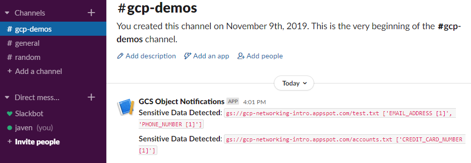

import Gist from 'react-gist';

This is a follow up to a previous blog, [__Google Cloud Storage Object Notifications using Slack__](https://cloudywithachanceofbigdata.com/google-cloud-storage-object-notifications-using-slack/) in which we used Slack to notify us of new objects being uploaded to GCS.

In this article we will take things a step further, where uploading an object to a GCS bucket will trigger a DLP inspection of the object and if any preconfigured info types (such as credit card numbers or API credentials) are present in the object, a Slack notification will be generated.

As DLP scans are “jobs”, meaning they run asynchronously, we will need to trigger scans and inspect results using two separate Cloud Functions (one for triggering a scan [`gcs-dlp-scan-trigger`] and one for inspecting the results of the scan [`gcs-dlp-evaluate-results`]) and a Cloud PubSub topic [`dlp-scan-topic`] which is used to hold the reference to the DLP job.

The process is described using the sequence diagram below:

## The Code

The `gcs-dlp-scan-trigger` Cloud Function fires when a new object is created in a specified GCS bucket. This function configures the DLP scan to be executed, including the DLP info types (for instance `CREDIT_CARD_NUMBER`, `EMAIL_ADDRESS`, `ETHNIC_GROUP`, `PHONE_NUMBER`, etc) a and likelihood of that info type existing (for instance `LIKELY`). DLP scans determine the probability of an info type occurring in the data, they do not scan every object in its entirety as this would be too expensive.

The primary function executed in the `gcs-dlp-scan-trigger` Cloud Function is named `inspect_gcs_file`. This function configures and submits the DLP job, supplying a PubSub topic to which the DLP Job Name will be written, the code for the `inspect_gcs_file` is shown here:

<Gist id="913a4457f43bc7b80e4405dd01f7b64d" 
/>

At this stage the DLP job is created an running asynchronously, the next Cloud Function, `gcs-dlp-evaluate-results`, fires when a message is sent to the PubSub topic defined in the DLP job. The `gcs-dlp-evaluate-results` reads the DLP Job Name from the PubSub topic, connects to the DLP service and queries the job status, when the job is complete, this function checks the results of the scan, if the `min_likliehood` threshold is met for any of the specified info types, a Slack message is generated. The code for the main method in the `gcs-dlp-evaluate-results` function is shown here:

<Gist id="ab377f6c3e448ae7c623d057239e05ed" 
/>

Finally, a Slack webhook is used to send the message to a specified Slack channel in a workspace, this is done using the `send_slack_notification` function shown here:

<Gist id="15d9e7c0922c26b680bed81abfcbadff" 
/>

An example Slack message is shown here:

> Full source code can be found at: [https://github.com/gamma-data/automated-gcs-object-scanning-using-dlp-with-notifications-using-slack](https://github.com/gamma-data/automated-gcs-object-scanning-using-dlp-with-notifications-using-slack)

> if you have enjoyed this post, please consider [__buying me a coffee ☕__](https://www.buymeacoffee.com/jeffreyaven) to help me keep writing!