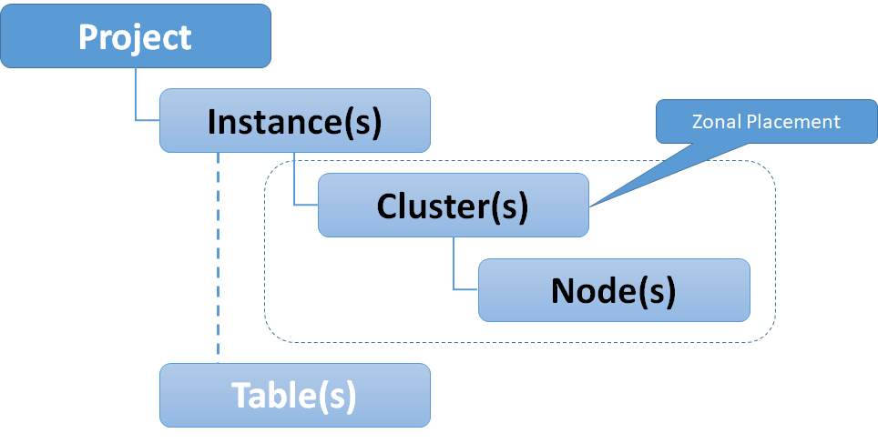

Bigtable is one of the foundational services in the Google Cloud Platform and to this day one of the greatest contributions to the big data ecosystem at large. It is also one of the least known services available, with all the headlines and attention going to more widely used services such as BigQuery.

## Background

In 2006 (pre Google Cloud Platform), Google released a white paper called _**“Bigtable: A Distributed Storage System for Structured Data”**_, this paper set out the reference architecture for what was to become Cloud Bigtable. This followed several other whitepapers including the GoogleFS and MapReduce whitepapers released in 2003 and 2004 which provided abstract reference architectures for the Google File System (now known as **_Colossus_**) and the MapReduce algorithm. These whitepapers inspired a generation of open source distributed processing systems including Hadoop. Google has long had a pattern of publicising a generalized overview of their approach to solving different storage and processing challenges at scale through white papers.

[](https://cloudywithachanceofbigdata.com/wp-content/uploads/2020/08/bigtable-osdi06.pdf)

Bigtable Whitepaper 2006

The Bigtable white paper inspired a wave of open source distributed key/value oriented NoSQL data stores including Apache HBase and Apache Cassandra.

## What is Bigtable?

Bigtable is a distributed, petabyte scale NoSQL database. More specifically, Bigtable is…

### a map

At its core Bigtable is a distributed map or an associative array indexed by a row key, with values in columns which are created only when they are referenced. Each value is an uninterpreted byte array.

### sorted

Row keys are stored in lexographic order akin to a clustered index in a relational database.

### sparse

A given row can have any number of columns, not all columns must have values and NULLs are not stored. There may also be gaps between keys.

### multi-dimensional

All values are versioned with a timestamp (or configurable integer). Data is not updated in place, it is instead superseded with another version.

## When (and when not) to use Bigtable

- You need to do many thousands of operations per second on TB+ scale data
- Your access patterns are well known and simple
- You need to support random write or random read operations (or sequential reads) - each using a row key as the primary identifier

### Don’t use Bigtable if…

- You need explicit JOIN capability, that is joining one or more tables
- You need to do ad-hoc analytics
- Your access patterns are unknown or not well defined

### Bigtable vs Relational Database Systems

The following table compares and contrasts Bigtable against relational databases (both transaction oriented and analytic oriented databases):

\[table id=6 /\]

## Bigtable Data Model

**_Tables_** in Bigtable are comprised of rows and columns (sounds familiar so far..). Every row is uniquely identified by a **_rowkey_** (like a primary key..again sounds familiar so far).

**_Columns_** belong to **_Column Families_** and only exist when inserted, NULLs are not stored - this is where it starts to differ from a traditional RDBMS. The following image demonstrates the data model for a fictitious table in Bigtable.

[](https://cloudywithachanceofbigdata.com/wp-content/uploads/2020/08/bigtable-data-model.png)

Bigtable Data Model

In the previous example, we created two Column Families (**_cf1_** and **_cf2_**). These are created during table definition or update operations (akin to DDL operations in the relational world). In this case, we have chosen to store primary attributes, like name, etc in cf1 and features (or derived attributes) in cf2 like indicators.

### Cell versioning

Each cell has a timestamp/version associated with it, multiple versions of a row can exist. Versions are naturally stored in descending order.

Properties such as the max age for a cell or the maximum number of versions to be stored for any given cell are set on the Column Family. Versions are compacted through a process called **_Garbage Collection_** - not to be confused with Java Garbage Collection (albeit same idea).

\[table id=7 /\]

## Bigtable Instances, Clusters, Nodes and Tables

Bigtable is a "no-ops" service, meaning you do not need to configure machine types or details about the underlying infrastructure, save a few sizing or performance options - such as the number of nodes in a cluster or whether to use solid state hard drives (SSD) or the magnetic alternative (HDD). The following diagram shows the relationships and cardinality for Cloud Bigtable.

[](https://cloudywithachanceofbigdata.com/wp-content/uploads/2020/08/bigtable-instances-and-nodes.png)

Bigtable Instances, Clusters and Nodes

**_Clusters_** and **_nodes_** are the physical compute layer for Bigtable, these are zonal assets, zonal and regional availability can be achieved through replication which we will discuss later in this article.

**_Instances_** are a virtual abstraction for clusters, Tables belong to instances (not clusters). This is due to Bigtables underlying architecture which is based upon a separation of storage and compute as shown below.

[](https://cloudywithachanceofbigdata.com/wp-content/uploads/2020/08/bigtable-storage-and-compute.png)

Bigtable Separation of Storage and Compute

Bigtables separation of storage and compute allow it to scale horizontally, as nodes are stateless they can be increased to increase query performance. The underlying storage system in inherently scalable.

### Physical Storage & Column Families

Data (Columns) for Bigtable is stored in **_Tablets_** (as shown in the previous diagram), which store "regions" of row keys for a particular Column Family. Columns consist of a column family prefix and qualifier, for instance:

```
cf1:col1
```

A table can have one or more Column Families. Column families must be declared at schema definition time (could be a create or alter operation). A cell is an intersection of a row key and a version of a column within a column family.

Storage settings (such as the compaction/garbage collection properties mentioned before) can be specified for each Column Family - which can differ from other column families in the same table.

### Bigtable Availability and Replication

**_Replication_** is used to increase availability and durability for Cloud Bigtable – this can also be used to segregate read and write operations for the same table.

Data and changes to tables are replicated across multiple regions or multiple zones within the same region, this replication can be blocking (single row transactions) or non blocking (eventually consistent). However all clusters within a Bigtable instance are considered primary (writable).

Requests are routed using **_Application Profiles_**, a **_single-cluster routing_** policy can be used for manual failover, whereas a **_multi-cluster routing_** is used for automatic failover.

### Backup and Export Options for Bigtable

Managed backups can be taken at a table level, new tables can be created from backups. The backups cannot be exported, however table level export and import operations are available via pre-baked Dataflow templates for data stored in GCS in the following formats:

- SequenceFiles
- Avro Files
- Parquet Files
- CSV Files

## Accessing Bigtable

Bigtable data and admin functions are available via:

- `cbt` (optional component of the Google SDK)
- `hbase shell` (REPL shell)
- Happybase API (Python API for Hbase)
- SDK libraries for:
    - Golang
    - Python
    - Java
    - Node.js
    - Ruby
    - C#, C++, PHP, and more

As Bigtable is not a cheap service, there is a local emulator available which is great for application development. This is part of the Cloud SDK, and can be started using the following command:

```
gcloud beta emulators bigtable start
```

In the next article in this series we will demonstrate admin and data functions as well as the local emulator.

> Next Up : Part II - Row Key Selection and Schema Design in Bigtable
