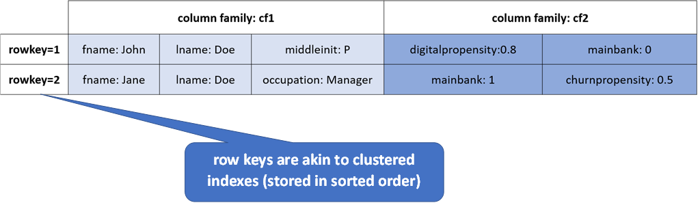
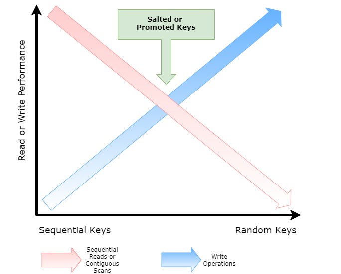

This is a follow up to the original Cloud Bigtable primer where we discussed the basics of Cloud Bigtable:

[__Cloud Bigtable Primer - Part I__](https://cloudywithachanceofbigdata.com/cloud-bigtable-primer-part-i/)

In this article we will cover schema design and row key selection in Bigtable – arguably the most critical design decision to make when employing Bigtable in a cloud data architecture.

## Quick Review

Recall from the previous post where the Bigtable data model was introduced that tables in Bigtable are comprised of rows and columns - much like a table in any other RDBMS. Every row is uniquely identified by a rowkey – again akin to a primary key in a table in an RDBMS. But this is where the similarities end.

Unlike a table in an RDBMS, columns only ever exist when they are inserted, and `NULLs` are not stored. See the illustration below:

## Row Key Selection

Data in Bigtable is distributed by row keys. Row keys are physically stored in tablets in lexographic order. Recall that row keys are your ONLY indexes to data in Bigtable.

### Selection Considerations

As row keys are your only indexes to retrieve or update rows in Bigtable, row key design must take the access patterns for the data to be stored and served via Bigtable into consideration, specifically the following must be considered when designing a Bigtable application:

- Search patterns (returning data for a specific entity)
- Scan patterns (returning batches of data)

Queries that use the row key, a row prefix, or a row range are the most efficient. Queries that do not include a row key will typically scan GB or TB of data and would not be suitable for operational use cases.

### Row Key Performance

Row key performance will be biased towards your specific access patterns and application functional requirements. For example if you are performing sequential reads or scan operations then sequential keys will perform the best, however their write performance will not be optimal. Conversely, random keys (such as a `uuid`) will perform best for writes but poor for scan or sequential read operations.

Adding salts to keys (or additional data), similar to the use of salts in cryptography as well as promoting other field keys to be part of a composite row key can help achieve a “Goldilocks” scenario for both reads and writes, see the diagram below:

### Using Reverse Timestamps

Use reverse timestamps when your most common query is for the latest values. Typically you would append the reverse timestamp to the key, this will ensure that the same related records are grouped together, for instance if you are storing events for a customer using the customer id along with an appended reverse timestamp (for example `<customer_id>#<reverse_ts>`) would allow you to quickly serve the latest events for a customer in descending order as within each group (`customer_id`), rows will be sorted so most recent insert will be located at the top.  
A reverse timestamp can be generalised as:

`Long.MAX_VALUE - System.currentTimeMillis()`

### Schema Design Tips

Some general tips for good schema design using Bigtable are summarised below:

- Group related data for more efficient reads using column families
- Distribute data evenly for more efficient writes
- Place identical values in the adjoining rows for more efficient compression using row keys

Following these tips will give you the best possible performance using Bigtable.

### Use the Key Visualizer to profile performance

Google provides a neat tool to visualize your row key distribution in Cloud Bigtable. You need to have at least 30 GB of data in your table to enable this feature.

The Key Visualizer is shown here:

The Key Visualizer will help you find and prevent hotspots, find rows with too much data and show if your key schema is balanced.

### Summary

Bigtable is one of the original and best (massively) distributed NoSQL platforms available. Schema and moreover row key design play a massive part in ensuring low latency and query performance. Go forth and conquer with Cloud Bigtable!
