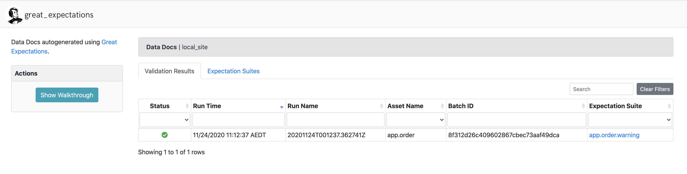
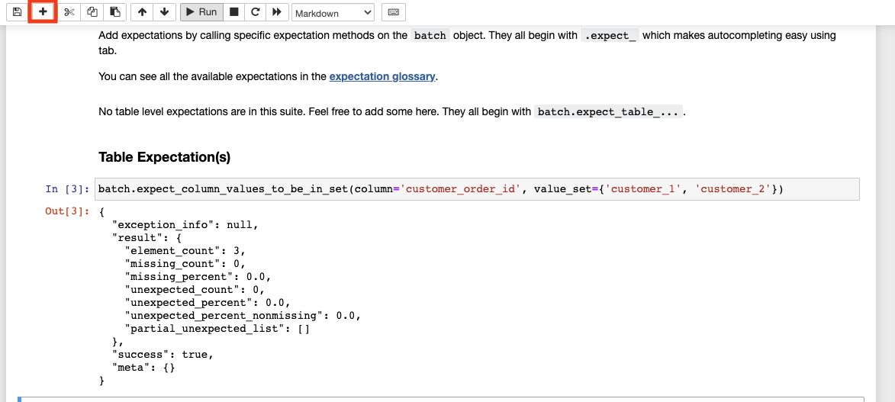

import Gist from 'react-gist';


This article provides an introduction to the Great Expectations Python library for data quality management ([https://github.com/great-expectations/great\_expectations](https://github.com/great-expectations/great_expectations)).

So what are expectations when it comes to data (and data quality)...

An expectation is a falsifiable, verifiable statement about data. Expectations provide a language to talk about data characteristics and data quality - humans to humans, humans to machines and machines to machines.

The **great expectations** project includes predefined, codified expectations such as:

```
expect_column_to_exist 
expect_table_row_count_to_be_between 
expect_column_values_to_be_unique 
expect_column_values_to_not_be_null 
expect_column_values_to_be_between 
expect_column_values_to_match_regex 
expect_column_mean_to_be_between 
expect_column_kl_divergence_to_be_less_than
```

… and many more

Expectations are both data tests and docs! Expectations can be presented in a machine-friendly JSON, for example:

<Gist id="317fa68cc27e4e364ab238a93f6ed361" 
/>

Great Expectations provides validation results of defined expectations, which can dramatically shorten your development cycle.

[](validation results in great expectations)

Nearly 50 built in expectations allow you to express how you understand your data, and you can add custom expectations if you need a new one. A machine can test if a dataset conforms to the expectation.

## OK, enough talk, let's go!

```bash
pyenv virtualenv 3.8.2 ge38
pip install great-expectations
```

tried with Python 3.7.2, but had issues with library `lgzm` on my local machine

once installed, run the following in the python repl shell:

<Gist id="78211408899d5d0d4b1a088d039fe1d3" 
/>

showing the data in the dataframe should give you the following:

<Gist id="fbdeda83bfe9af7ceb33a36a3f4a29e0" 
/>

as can be seen, a collection of random integers in each column for our initial testing. Let's pipe this data in to great-expectations...

<Gist id="0bf00ff1bfad316f83f1b458aa2ad01b" 
/>

yields the following output...

<Gist id="83264e645d220ebb0f0a529a2a139be9" 
/>

this shows that there are 0 unexpected items in the data we are testing. Great!

Now let's have a look at a negative test. Since we've picked the values at random, there are bound to be duplicates. Let's test that:

<Gist id="0a75fe9700677d0329d96da44c54dca5" 
/>

yields...

<Gist id="0c714a928064124ec15c9733d9e5ff29" 
/>

The JSON schema has metadata information about the result, of note is the result section which is specific to our query, and shows the percentage that failed the expectation.

Let's progress to something more real-world, namely creating exceptions that are run on databases. Armed with our basic understanding of great-expectations, let's...

- set up a postgres database
- initiate a new Data Context within great-expectations
- write test-cases for the data
- group those test-cases and
- run it

## Setting up a Database

<Gist id="30dc4a230656f36c4c9b7b208b792329" 
/>

if you don't have it installed,

<Gist id="b127a57c499e63c003ac6c8bb4408768" 
/>

wait 15 minutes for download the internet. Verify postgres running with `docker ps`, then connect with

<Gist id="d33c81448fcfddb608f79a69a75202a1" 
/>

Create some data

<Gist id="13069c3111039ac60281f291dc1e6bd8" 
/>

Take data for a spin

<Gist id="f62857c6dbaaaf1d784aa94c5914c9f5" 
/>

should yield

<Gist id="52e11ea7319f8344674999ec1b36ab0e" 
/>

Now time for `great-expectations`

Great Expectations relies on the library `sqlalchemy` and `psycopg2` to connect to your data.

<Gist id="6bd28c03b4013f4301b1af2c74dcd947" 
/>

once done, let's set up `great-expectations`

<Gist id="4210011daa1fb3c738875f917ebafbf3" 
/>

should look like below:

<Gist id="1f1a698cf6a6785598db1133212f30fe" 
/>

let's set up a few other goodies while we're here

<Gist id="51f684d6db8149950f28cc32afa2f461" 
/>

**Congratulations! Great Expectations is now set up**

You should see a file structure as follows:

[](images/ge_tree_structure.png)

If you didn't generate a suite during the set up based on `app.order`, you can do so now with

`great_expectations suite new`

when created, looking at `great_expectations/expectations/app/order/warning.json` should yield the following:

<Gist id="24d105be1cacacbd89b9e4cbac6f4d21" 
/>

as noted in the content section, this expectation config is created by the tool by looking at 1000 rows of the data. We also have access to the data-doc site which we can open in the browser at `great_expectations/uncommitted/data_docs/local_site/index.html`

[](images/index-page.png)

Clicking on `app.order.warning`, you'll see the sample expectation shown in the UI

[](images/ge-app.order-screen.png)

Now, let's create our own `expectation` file and take it for a spin. We'll call this one `error`.

[](images/ge_suite_new.png)

This should also start a `jupyter notebook`. If for some reason you need to start it back up again, you can do so with

<Gist id="b4c9fed39b89d939127e4b381c49f274" 
/>

Go ahead and hit `run` on your first cell.

[](images/jupyter-edit-suite.png)

Let's keep it simple and test the `customer_order_id` column is in a set with the values below:

<Gist id="fea43e4e566795213fc1c5bbcda317ad" 
/>

using the following expectations function in your Table Expectation(s). You may need to click the `+` sign in the toolbar to insert a new cell, as below:

<Gist id="38be05ccb27c21da2b4213d6a63afd83" 
/>

[](images/add-table-expectation.png)

As we can see, appropriate json output that describes the output of our expectation. Go ahead and run the final cell, which will save our work and open a newly minted data documentation UI page, where you'll see the expectations you defined in human readable form.

[](images/saved-suite.png)

## Running the test cases

In Great Expectations, running a set of expectations (test cases) is called a `checkpoint`. Let's create a new checkpoint called `first_checkpoint` for our `app.order.error` expectation as shown below:

<Gist id="322483724633e8a4513c5d6ae67298ae" 
/>

Let's take a look at our checkpoint definition.

<Gist id="08594ad6420d46fe60be41d9d949605c" 
/>

<Gist id="9cdd4da31f9fdef1246092fa5b65e90c" 
/>

Above you can see the `validation_operator_name` which points to a definition in `great_expectations.yml`, and the `batches` where we defined the data source and what expectations to run against.

Let's have a look at `great_expectations.yml`. We can see the `action_list_operator` defined and all the actions it contains:

[](images/ge_action_list_operator.png)

Let's run our checkpoint using

<Gist id="050501513ee0f5fa13ab522ea7b9242e" 
/>

[](images/validate-checkpoint.png)

Okay cool, we've set up an expectation, a checkpoint and shown a successful status! But what does a failure look like? We can introduce a failure by logging in to postgres and inserting a `customer_11` that we'll know will fail, as we've specific our expectation that `customer_id` should only have two values..

<Gist id="5bce4ba20ab8bfae5910db5cd6cc66f4" 
/>

Here are the commands to make that happen, as well as the command to re-run our checkpoint:

<Gist id="4ad6f1753d65a4f099467bd9fd760067" 
/>

<Gist id="fa94ded27b212e099177bee9d6a2cd36" 
/>

Run checkpoint again, this time it should fail

<Gist id="12fb3e62a5bbcd205ee84ff7445e2657" 
/>

[](images/failed-checkpoint.png)

**As expected, it failed.**

## Supported Databases

In it's current implementation `version 0.12.9`, the supported databases our of the box are:

<Gist id="4816fb9a621d2d660f746b62ab54ba59" 
/>

It's great to be BigQuery supported out of the box, but what about Google Spanner and Google BigTable? Short-answer; currently not supported. See tickets [https://github.com/googleapis/google-cloud-python/issues/3022](https://github.com/googleapis/google-cloud-python/issues/3022).

With respect to BigTable, it may not be possible as SQLAlchemy can only manage SQL-based RDBSM-type systems, while BigTable (and HBase) are NoSQL non-relational systems.

## Scheduling

Now that we have seen how to run tests on our data, we can run our checkpoints from bash or a python script(generated using great_expectations checkpoint script first_checkpoint). This lends itself to easy integration with scheduling tools like airflow, cron, prefect, etc.

## Production deployment

When deploying in production, you can store any sensitive information(credentials, validation results, etc) which are part of the uncommitted folder in cloud storage systems or databases or data stores depending on your infratructure setup. Great Expectations has a lot of options

## When not to use a data quality framework

This tool is great and provides a lot of advanced data quality validation functions, but it adds another layer of complexity to your infrastructure that you will have to maintain and trouble shoot in case of errors. It would be wise to use it only when needed.

## In general

Do not use a data quality framework, if simple SQL based tests at post load time works for your use case. Do not use a data quality framework, if you only have a few (usually < 5) simple data pipelines.

Do use it when you have data that needs to be tested in an automated and a repeatable fashion. As shown in this article, Great Expectations has a number of options that can be toggled to suit your particular use-case.

## Conclusion

Great Expectations shows a lot of promise, and it's an active project so expect to see features roll out frequently. It's been quite easy to use, but I'd like to see all it's features work in a locked-down enterprise environment.

Tom Klimovski  
Principal Consultant, Gamma Data  
[tom.klimovski@gammadata.io](mailto:tom.klimovski@gammadata.io)
