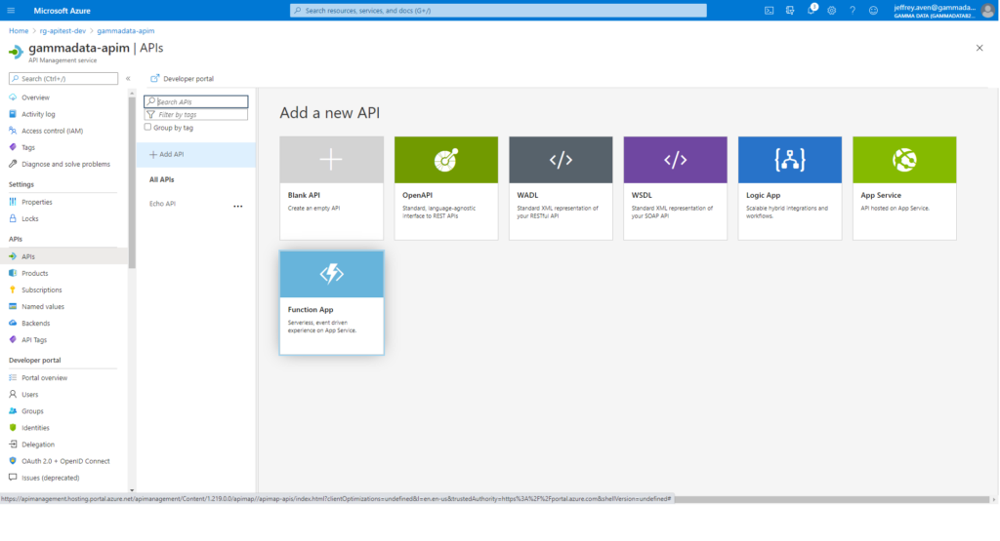
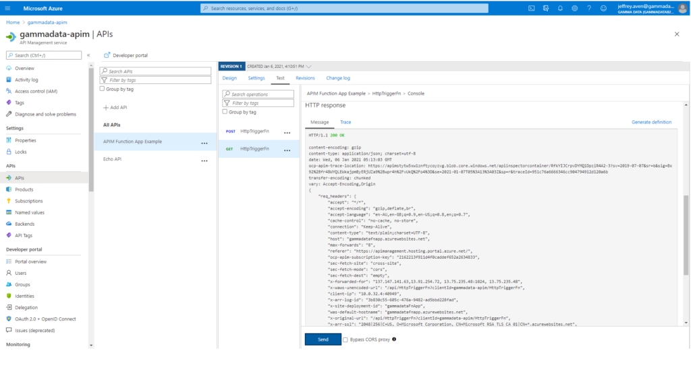
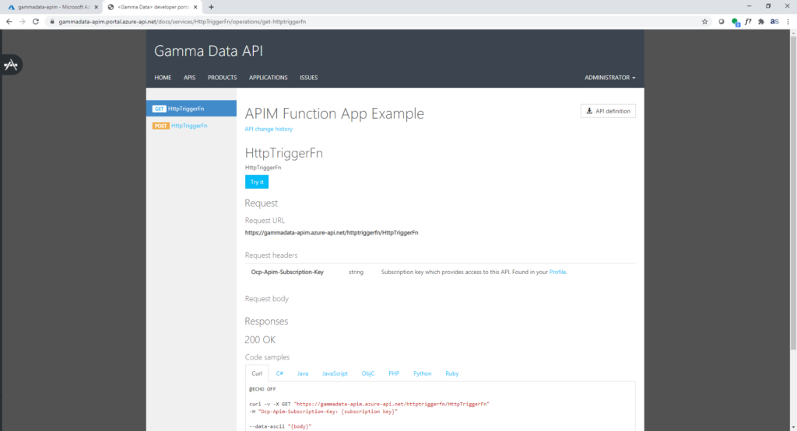

Function Apps, Logic Apps and App Services can be used to expose APIs within Azure API Management which is an easy way to deploy serverless microservices. You can see this capability in the Azure portal below within API Management:

Add a new API using a Function App as a back end

Like most readers, I like to script everything, so I was initially frustrated when I couldn’t replicate this operation in the Azure cli, REST, PowerShell, or any of the other SDKs or IaC tools. Others shared my frustration as seen [here](https://feedback.azure.com/forums/248703-api-management/suggestions/36832033-programmatically-import-azure-function-into-apim).

I was nearly resigned to using click ops in the portal (arrrgh) before I worked out this workaround.

## The Solution

There is a bit more prep work required to automate this process, but it is well worth it.

1\. Create an OpenApi (or Swagger spec or WADL) specification document, as seen below (use the absolute URL for your Function App in the `url` parameter):

2\. Use the `az apim api import` function (not the `az apim api create` function), as shown here:

3\. Associate the API with a product (which is how you can rate limit APIs)

That’s it! You can now access your function via the API gateway using the gateway url or via the developer portal as seen below:

Function App API in API Management in the Azure Portal

Function App API in the Dev Portal
