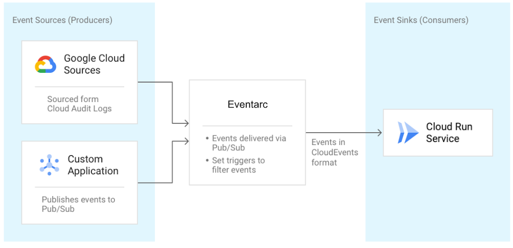

When defining event-driven architectures, it's always good to keep up with how the landscape is changing. How do you connect microservices in your architecture? Is Pub/Sub the end-game for all events? To dive a bit deeper, let's talk through the benefits of having a single _orchestrator_, or perhaps a choreographer is better?

## Orchestration versus choreography refresher

My colleague [@jeffreyaven](https://www.linkedin.com/in/jeffreyaven/) did a recent post explaining this concept in simple terms, which is worth reviewing, see:

[__Microservices Concepts: Orchestration versus Choreography__](https://cloudywithachanceofbigdata.com/microservices-concepts-orchestration-versus-choreography/)

Should there really be a central orchestrator controlling all interactions between services.....or, should each service work independently and only interact through events?

- **Orchestration** is usually viewed as a domain-wide central service that defines the flow and control of communication between services. In this paradigm, in becomes easier to change and ultimately monitor policies across your org.
- **Choreography** has each service registering and emitting events as they need to. It doesn't direct or define the flow of communication, but using this method usually has a central broker passing around messages and allows services to be truly independent.

Enter [Workflows](https://cloud.google.com/workflows), which is suited for centrally orchestrated services. Not only Google Cloud service such as Cloud Functions and Cloud Run, but also external services.

How about choreography? [Pub/Sub](https://cloud.google.com/pubsub) and [Eventarc](https://cloud.google.com/blog/products/serverless/build-event-driven-applications-in-cloud-run) are both suited for this. We all know and love Pub/Sub, _but how do I use EventArc?_

## What is Eventarc?

Announced in October-2020, it was introduced as eventing functionality that enables you, the developer, to send events _to_ Cloud Run from more than 60 Google Cloud sources.

### But how does it work?

Eventing is done by reading those sweet sweet Audit Logs, from various sources, and sending them to Cloud Run services as events in [Cloud Events](https://cloudevents.io/) format. Quick primer on Cloud Events: its a specification for describing event data in a common way. The specification is now under the [Cloud Native Computing Foundation](https://cncf.io/). Hooray! It can also read events from Pub/Sub topics for custom applications. Here's a diagram I graciously ripped from [Google Cloud Blog](https://cloud.google.com/blog/topics/developers-practitioners/eventarc-unified-eventing-experience-google-cloud):

### Why do I need Eventarc? I have the Pub/Sub

Good question. Eventarc provides and easier path to receive events not only from Pub/Sub topics but from a number of Google Cloud sources with its Audit Log and Pub/Sub integration. Actually, _any_ service that has Audit Log integration can be an event source for Eventarc. Beyond easy integration, it provides consistency and structure to how events are generated, routed and consumed. Things like:

#### **Triggers**

They specify routing rules from events sources, to event sinks. Listen for new object creation in GCS and route that event to a service in Cloud Run by creating an Audit-Log-Trigger. Create triggers that also listen to Pub/Sub. Then list **all** triggers in one, central place in Eventarc:

`gcloud beta eventarc triggers list`

#### **Consistency with eventing format and libraries**

Using the CloudEvent-compliant specification will allow for event data in a common way, increasing the movement towards the goal of consistency, accessibility and portability. Makes it easier for different languages to read the event and Google Events Libraries to parse fields.

This means that the long-term vision of Eventarc to be the **hub** of events, enabling a unified eventing story for Google Cloud and beyond.

In the future, you can excpect to forego Audit Log and read these events directly and send these out to even more sinks within GCP and any HTTP target.

* * *

This article written on inspiration from [https://cloud.google.com/blog/topics/developers-practitioners/eventarc-unified-eventing-experience-google-cloud](https://cloud.google.com/blog/topics/developers-practitioners/eventarc-unified-eventing-experience-google-cloud). Thanks Mete Atamel!
