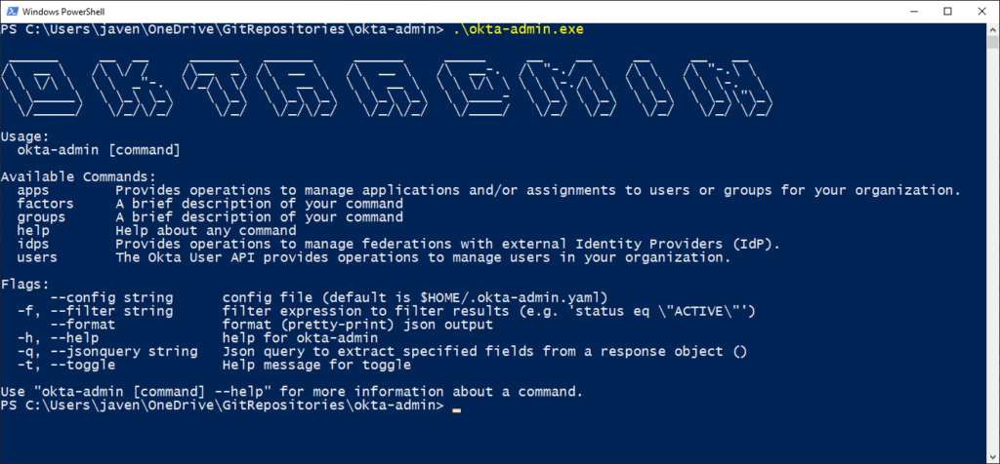

Identity and Access Management is a critical component of any application or SaaS architecture. I’m currently doing a spike of the Okta solution for an application development project I am on. Okta is a comprehensive solution built on the open OAuth2 and OIDC protocols, as well as supporting more conventional identity federation approaches such as SAML.

Okta has a clean and easy to use web-based Admin interface which can be used to create applications, users, claims, identity providers and more.

During my spike, which was done in a crash and burn test Okta organisation, I had associated my user account with a Microsoft Identity Provider for SSO, and subsequently had issues accessing the Microsoft Account my user was associated with, as a result I managed to lock myself (the super admin) out of the Okta Admin Console.

Fortunately, prior to doing this I had created an API token for my user. So, I went about looking at ways I could interact with Okta programmatically. My first inclination was to use a simple CLI for Okta to get me out of jail… but I found there wasn’t one that suited. There are, however, a wealth of SDKs for Okta across multiple front-end and back-end oriented programming languages (such as JavaScript, Golang, Python and more).

Being in lockdown and having some free time on my hands, I decided to create a simple open source command line tool which could be used to administer an Okta organisation. The result of this weekend lockdown is `okta-admin`…

okta-admin cli

For this project I used the [Golang SDK for Okta](https://github.com/okta/okta-sdk-golang), along with the [Cobra](https://github.com/spf13/cobra) and [Viper](https://github.com/spf13/viper) Golang packages (used by `docker`, `kubectl` and other popular command line utilities). To provide a query interface to JSON response payloads I use [GJson](https://github.com/tidwall/gjson).

Will keep adding to this so stay tuned...

> Complete source code for this project is available at [https://github.com/gammastudios/okta-admin](https://github.com/gammastudios/okta-admin)
