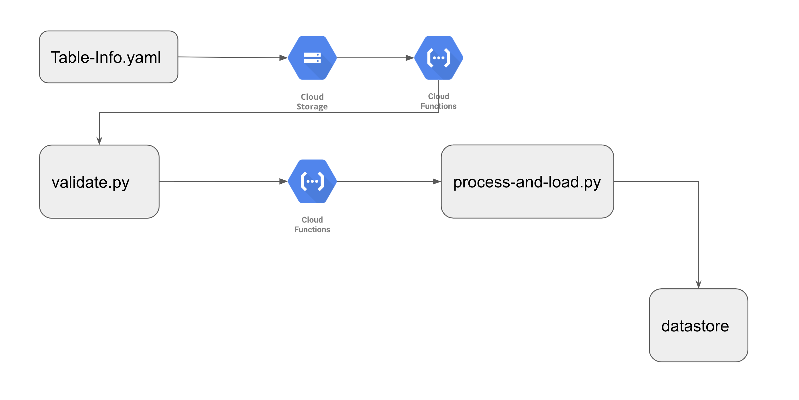
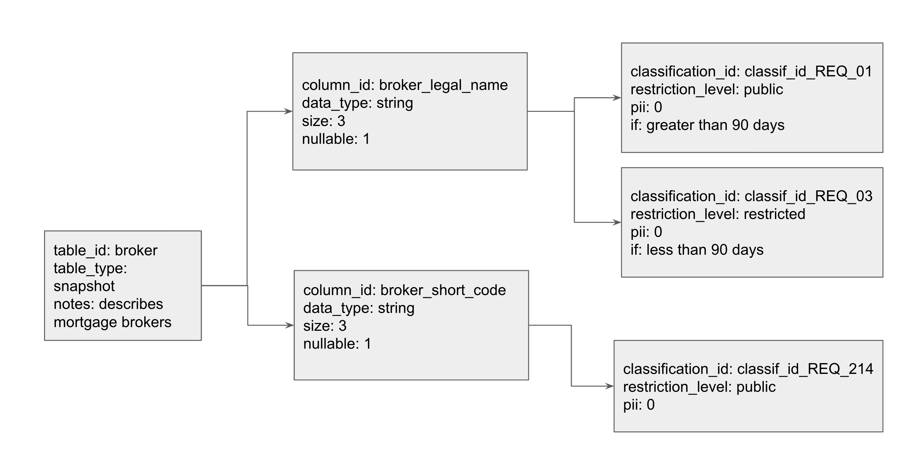

Metadata Hub (MDH) is intended to be the source of truth for metadata around the Company’s platform. It has the ability to load metadata configuration from yaml, and serve that information up via API. It will also be the store of information for pipeline information while ingesting files into the platform.

## Key philosophies:

> **Config-Driven**. Anyone who has been authorized to do so, should be able to add another ‘table-info.yaml’ in to MDH without the need to update any code in the system

Here’s how table information makes its way into MDH: [](images/mdh-overview.png)  

### Paths

|  |  |  |  |
| --- | --- | --- | --- |
| /tables | get: | summary: All tables in MDH | description: get the title of all tables that exist in MDH |
|  | post: | summary: Creates a new table in MDH | description: Creates a new table in MDH |
| /tables/{id} | get | summary: Obtain information about specific table |  |
| /tables/{id}/columns | get | summary: All columns for a particular table | description: Obtain information on columns for a particular table |
| /run | get | summary: All information about a particular end-to-end batch run of file ingestion |  |
|  | post | summary: Update metadata on a batch load | description: Update metadata on a batch load |
| /calendar | get | summary: Use this to save on calculation of business days. | description: This base response gives you today's date in a string |
| /calendar/previousBusinessDay | get | summary: Will return a string of the previous business day | description: Will return a string of the previous business day, based on the date on when it's called |
| /calendar/nextBusinessDay | get | summary: Will return a string of the next business day | description: Will return a string of the next business day, based on the date on when it's called |
|  |  |  |  |

# Yaml to Datastore - Entity/Kind design

### Datastore Primer

Before we jump right into Entity Groups in Datastore, it is important to first go over the basics and establish a common vocabulary. Datastore holds entities, which are objects, that can contain various key/value pairs, called properties. Each entity must contain a unique identifier, known as a key. When creating an entity, a user can choose to specify a custom key or let Datastore create a key. If a user decides to specify a custom key, it will contain two fields: a kind, which represents a category such as ‘Toy’ or ‘Marital Status’, and a name, which is the identifying value. If a user decides to only specify a kind when creating a key, and does not specify a unique identifier, Datastore automatically generates an ID behind the scenes. Below is an example of a Python3 script which illustrates this identifier concept.

```python
from google.cloud import datastore

client = datastore.Client()
#Custom key- specify my kind=item and a unique_id of broker
custom_key_entry = datastore.Entity(client.key("table","broker"))
client.put(custom_key_entry)

#Only specify kind=item, let datastore generate unique_id
datastore_gen_key_entry = datastore.Entity(client.key("table"))
client.put(datastore_gen_key_entry)
```

In your GCP Console under Datastore, you will then see your two entities of kind “table”. One will contain your custom key and one will contain the automatically generated key.

Ancestors and Entity Groups

For highly related or hierarchical data, Datastore allows entities to be stored in a parent/child relationship. This is known as an entity group or ancestor/descendent relationship.

### Entity Group

[](images/erd.png)

_This is an example of an entity group with kinds of types: table, column, and classification. The ‘Grandparent’ in this relationship is the ‘table’. In order to configure this, one must first create the table entity. Then, a user can create a column, and specify that the parent is a table key. In order to create the grandchild, a user then creates a classification and sets its parent to be a column key. To further add customizable attributes, a user can specify additional key-value pairs such as pii and data_type. These key-value pairs are stored as properties. We model this diagram in Datastore in our working example below._

One can create entity groups by setting the ‘parent’ parameter while creating an entity key for a child. This command adds the parent key to be part of the child entity key. The child’s key is represented as a tuple (‘parent_key’, ‘child_key’), such that the parents’ key is the prefix of the key, which is followed by its own unique identifier. For example, follow the diagram above:

```python
table_key = datastore_client.key("table","broker")
column_key = datastore_client.key("column","broker_legal_name", parent=table_key)
```

Printing the variable `table_key` will display: `("table", "broker","column", "broker_legal_name")`

Datastore also supports chaining of parents, which can lead to very large keys for descendants with a long lineage of ancestors. Additionally, parents can have multiple children (representing a one-to-many relationship). However, there is no native support for entities to have multiple parents (representing a many-to-many relationship). Once you have configured this ancestral hierarchy, it is easy to retrieve all descendants for a given parent. You can do this by querying on the parent key by using the ‘ancestor’ parameter. For example, given the entity table_key created above, I can query for all of the tables

```python
columns: my_query = client.query(kind="table", ancestor = column_key) .
```

# A Full Working Example for MDH

As per our Key Philosophies - **_Config-Driven_** - anyone should be able to add a new `table` to be processed and landed in a target-table somewhere within MDH with our yaml syntax. Below is a full working python3 example of the table/column/classification hierarchical model described above.

```python
from google.cloud import datastore

datastore_client = datastore.Client()

# Entities with kinds- table, column, classification
my_entities = [
{"kind": "table", "table_id": "broker", "table_type": "snapshot",
    "notes": "describes mortgage brokers"},
{"kind": "column", "column_id": "broker_legal_name", "table_id": "broker",
    "data_type": "string", "size": 20, "nullable": 1},
{"kind": "column", "column_id": "broker_short_code", "table_id": "broker",
    "data_type": "string", "size": 3, "nullable": 1},
{"kind": "classification", "classification_id":"classif_id_REQ_01",
    "restriction_level": "public", "pii": 0, "if": "greater than 90 days",
    "column_id": "broker_legal_name", "table_id": "broker"},
{"kind": "classification", "classification_id":"classif_id_REQ_03",
    "restriction_level": "restricted", "pii": 0, "if": "less than 90 days",
    "column_id": "broker_legal_name", "table_id": "broker"},
{"kind": "classification", "classification_id":"classif_id_REQ_214",
    "restriction_level": "public", "pii": 0, "column_id": "broker_short_code",
    "table_id": "broker"},
]


# traverse my_entities, set parents and add those to datastore
for entity in my_entities:
    kind = entity['kind']
    parent_key = None
    if kind == "column":
        parent_key = datastore_client.key("table", entity["table_id"])
    elif kind == "classification":
        parent_key = datastore_client.key("table", entity["table_id"],
                                          "column", entity["column_id"])

    key = datastore_client.key(kind, entity[kind+"_id"],
        parent=parent_key)
    datastore_entry = datastore.Entity(key)
    datastore_entry.update(entity)

    print("Saving: {}".format(entity))

    datastore_client.put(datastore_entry)
```

The code above assumes that you’ve set yourself up with a working Service Account or authorised yourself in, and that your GCP project has been set.

Now let’s do some digging around our newly minted Datastore model. Let’s grab the column ‘broker_legal_name’

```python
query1 = datastore_client.query(kind="column")
query1.add_filter("column_id", "=", "broker_legal_name")
```

Now that we have the column entity, let’s locate it’s parent id.

```python
column = list(query1.fetch())[0]
print("This column belongs to: " +str(column.key.parent.id_or_name))
```

Further to this, we can also get all data classification elements attributed to a single column using the ancestor clause query.

```python
query2 = datastore_client.query(kind="classification", ancestor=column.key)
for classification in list(query2.fetch()):
    print(classification.key)
    print(classification["restriction_level"])
```

For more complex queries, Datastore has the concept of indexes being set, usually via it’s index.yaml configuration. The following is an example of an `index.yaml` file:

```yaml
indexes:
  - kind: Cat
    ancestor: no
    properties:
      - name: name
      - name: age
        direction: desc

  - kind: Cat
    properties:
      - name: name
        direction: asc
      - name: whiskers
        direction: desc

  - kind: Store
    ancestor: yes
    properties:
      - name: business
        direction: asc
      - name: owner
        direction: asc
```

Indexes are important when attempting to add filters on more than one particular attribute within a Datastore entity. For example, the following code will fail:

```python
# Adding a '>' filter will cause this to fail. Sidenote; it will work
# without an index if you add another '=' filter.
query2 = datastore_client.query(kind="classification", ancestor=column.key)
query2.add_filter("pii", ">", 0)
for classification in list(query2.fetch()):
        print(classification.key)
        print(classification["classification_id"])
```

To rectify this issue, you need to create an index.yaml that looks like the following:

```yaml
indexes:
  - kind: classification
    ancestor: yes
    properties:
      - name: pii
```

You would usually upload the yaml file using the gcloud commands:

`gcloud datastore indexes create path/to/index.yaml.`

However, let’s do this programmatically.

The official pypi package for google-cloud-datastore can be found here: https://pypi.org/project/google-cloud-datastore/. At the time of writing, Firestore in Datastore-mode will be the way forward, as per the release note from January 31, 2019.

> Cloud Firestore is now Generally Available. Cloud Firestore is the new version of Cloud Datastore and includes a backwards-compatible Datastore mode.

> If you intend to use the Cloud Datastore API in a new project, use Cloud Firestore in Datastore mode. Existing Cloud Datastore databases will be automatically upgraded to Cloud Firestore in Datastore mode.

> Except where noted, the Cloud Datastore documentation now describes behavior for Cloud Firestore in Datastore mode.

We’ve purposefully created MDH in Datastore to show you how it was done originally, and we’ll be migrating the Datastore code to Firestore in an upcoming post.

Creating and deleting indexes within Datastore will need to be done through the REST API via googleapiclient.discovery, as this function doesn’t exist via the google-cloud-datastore API. Working with the discovery api client can be a bit daunting for a first-time user, so here’s the code to add an index on Datastore:

```python
import os
from google.oauth2 import service_account
from googleapiclient.discovery import build
from google.cloud import datastore


SCOPES = ['https://www.googleapis.com/auth/cloud-platform']

SERVICE_ACCOUNT_FILE = os.getenv('GOOGLE_APPLICATION_CREDENTIALS')
PROJECT_ID = os.getenv("PROJECT_ID")

credentials = service_account
             .Credentials
         .from_service_account_file(SERVICE_ACCOUNT_FILE, scopes=SCOPES)

datastore_api = build('datastore', 'v1', credentials=credentials)

body = {
    'ancestor': 'ALL_ANCESTORS',
    'kind': 'classification',
    'properties': [{
        'name': 'pii',
        'direction': 'DESCENDING'
    }]
}

response = datastore_api.projects()
           .indexes()
           .create(projectId=PROJECT_ID, body=body)
           .execute()
```

How did we craft this API request? We can use the Google API Discovery Service to build client libraries, IDE plugins, and other tools that interact with Google APIs. The Discovery API provides a list of Google APIs and a machine-readable "Discovery Document" for each API. Features of the Discovery API:

- A directory of supported APIs schemas based on JSON Schema.
- A machine-readable "Discovery Document" for each of the supported APIs. Each document contains:
- A list of API methods and available parameters for each method.
- A list of available OAuth 2.0 scopes.
- Inline documentation of methods, parameters, and available parameter values.

Navigating to the API reference page for Datastore and going to the ‘Datastore Admin’ API page, we can see references to the Indexes and RESTful endpoints we can hit for those Indexes. Therefore, looking at the link for the Discovery document for Datastore:

> https://datastore.googleapis.com/$discovery/rest?version=v1

From this, we can build out our instantiation for the google api discovery object build('datastore', 'v1', credentials=credentials)

With respect to building out the body aspect of the request, I’ve found crafting that part within the ‘Try this API’ section of `https://cloud.google.com/datastore/docs/reference/admin/rest/v1/projects.indexes/create` pretty valuable.

With this code, your index should show up in your Datastore console! You can also retrieve them within gcloud with gcloud datastore indexes list if you’d like to verify the indexes outside our python code. So there you have it: a working example of entity groups, ancestors, indexes and Metadata within Datastore. Have fun coding!
