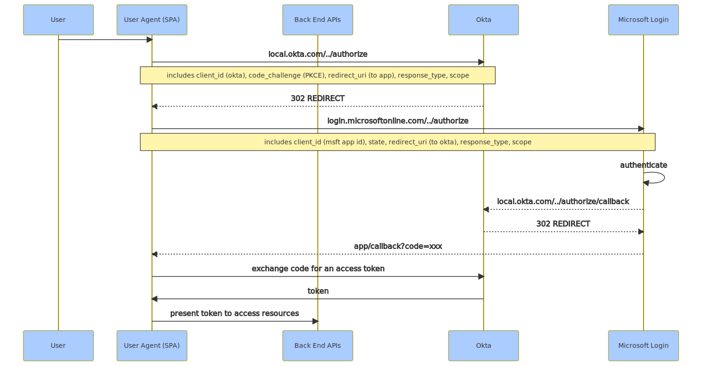

import Tabs from '@theme/Tabs';
import TabItem from '@theme/TabItem';
import Gist from 'react-gist';
import Mermaid from '/js/Mermaid/Mermaid.js';

This article describes a simple SSO pattern for authenticating and authorizing users from an external AD and to your application without requiring federation.  

## the Challenge  

You need to authenticate external users to use your application, these users belong to an organization using Azure Active Directory with specific login policies (such as password strength and expiry, multi factor authentication, etc).  Your requirements (if you choose to accept them) are:

1.	You are required to provide SSO to these users using their home AD tenant and policies
2.	The solution does not include SAML based federation between directories (yours and theirs)
3.	The solution does not require any changes on the external AD tenant (no new AAD applications, client secrets, etc)

## the Solution

Using an IDAM/IDaaS platform (such as Okta in this case), along with an AAD application (in your AD tenant in your Azure subscription), you can create a local AD app using this magic property to accomplish all of the above requirements (requiring zero changes on the third-party AD).  

[](images/azure-ad-app-registration.png) 

This is what it looks like using the `az` cli:

<Gist id="8b70fbe242da02ca844bf2fe53355743" 
/>

the `--available-to-other-tenants` property is Microsoft's way of allowing you to implicitly trust other AAD/Office 365 tenants, meaning the authentication request is passed to the target AD tenant from your application.  

Here is a context diagram which explains the interactions in the context of a Jamstack application (using a library such as Auth.js).  

<Tabs
  defaultValue="overview"
  values={[
    { label: 'Overview', value: 'overview', },
    { label: 'PlantUML', value: 'plantuml', },
  ]
}>
<TabItem value="overview">

[](images/okta-ad-sso-context-diagram.png) 

</TabItem>
<TabItem value="plantuml">

```plantuml
@startuml

!define C4Puml https://raw.githubusercontent.com/RicardoNiepel/C4-PlantUML/master
!includeurl C4Puml/C4_Context.puml
!includeurl C4Puml/C4_Component.puml
!includeurl C4Puml/C4_Container.puml

'left to right direction

!define Rel_NoRank(e_from,e_to, e_label=" ") Rel_(e_from,e_to, e_label, "-[norank]->")

!$imgroot = "https://github.com/avensolutions/plantuml-cloud-image-library/raw/main/images"

!unquoted procedure $AzureActiveDirectory($alias, $label, $techn, $descr="", $stereo="Azure Active Directory")
    rectangle "==$label\n\n\n//<size:12>[$techn]</size>//" <<$stereo>> as $alias #white
!endprocedure

!unquoted procedure $Okta($alias, $label, $techn, $descr="", $stereo="Okta")
    rectangle "==$label\n\n\n//<size:12>[$techn]</size>//" <<$stereo>> as $alias #white
!endprocedure

Person(user, User\n<i>UserAgent (Browser) )
Person(admin, Application Admin)
note right
Create users in the Okta org with the same email as the users email address in their AD (external AD)
end note
rectangle "Application Environment" <<boundary>> as app{
    $AzureActiveDirectory(localad, Local AD Tenant, Azure Active Directory)
    $Okta(okta, Local Okta Org, Okta)
}
$AzureActiveDirectory(otherad, Azure AD Tenant\n<i>(External AD), Azure Active Directory)

Lay_D(user, okta)
Lay_R(okta, localad)
Lay_R(localad, otherad)
Lay_D(okta, admin)

Rel_U(okta, user, access code)
Rel_D(user, okta, authorize request)
Rel_R(okta, localad, routes to)
Rel_R(localad, otherad, forwards to)
Rel_U(admin, okta, creates users)

@enduml
```

</TabItem>
</Tabs>

## Setup and Configuration  

The following flowchart explains the steps involved in setting this up.  The highlighted nodes are part of normal application lifecycle operations as users get created and deactivated.  

<Tabs
  defaultValue="flowchart"
  values={[
    { label: 'Flowchart', value: 'flowchart', },
    { label: 'Mermaid', value: 'mermaidCode', },
  ]
}>
<TabItem value="flowchart">

[](images/okta-ad-sso-setup-flowchart.svg) 

</TabItem>
<TabItem value="mermaidCode">

```
flowchart TD;
  subgraph Local Azure AD;
    a1(1. Create AD App);
  end;
  subgraph Okta;
    b1(2. Create IdP)-->b2(3. Create Application);
    b2-->b3(4. Create IdP\nRouting Rule\nfor Application);
    b3-->b4(5. Create Group);
    b4-->b5(6. Assign Group\nto Application);
    b5-->c1(7. Create User);
    c1-->c2(8. Add User to Group);
    style c1 fill:#f9f,stroke:#333,stroke-width:4px;
    style c2 fill:#f9f,stroke:#333,stroke-width:4px;
  end;
  subgraph Application;
    d1(9. Configure ISSUER\nand CLIENTID);		
  end;
  a1-->Okta;
  b3-->Application;
```

</TabItem>
</Tabs>

## Authorisation flow

The authorization flow for a public client (SPA) using PKCE (Proof Key for Code Exchange) is shown here:    

<Tabs
  defaultValue="sequence"
  values={[
    { label: 'Sequence', value: 'sequence', },
    { label: 'Mermaid', value: 'mermaidCode', },
  ]
}>
<TabItem value="sequence">

[](images/okta-ad-sso-authorization-flow.svg)

</TabItem>
<TabItem value="mermaidCode">

```
sequenceDiagram;
  %%{init: {'theme': 'base', 'themeVariables': { 'primaryColor': '#AACCFF', 'primaryBorderColor': '#999000', 'actorLineColor': '#000000' }}}%%;
  participant user as User;
  participant spa as User Agent (SPA);
  participant be as Back End APIs;
  participant okta as Okta;
  participant msft as Microsoft Login;
  user->>spa: ;
  spa->>okta: local.okta.com/../authorize;
  Note over spa,okta: includes client_id (okta), code_challenge (PKCE), redirect_uri (to app), response_type, scope
  okta-->>spa: 302 REDIRECT; 
  spa->>msft: login.microsoftonline.com/../authorize;
  Note over spa,msft: includes client_id (msft app id), state, redirect_uri (to okta), response_type, scope
  msft->>msft: authenticate;
  msft-->>okta: local.okta.com/../authorize/callback;
  okta-->>msft:  302 REDIRECT;
  msft-->>spa: app/callback?code=xxx;
  spa->>okta: exchange code for an access token;
  okta->>spa: token;
  spa->>be: present token to access resources;
```

</TabItem>
</Tabs>

## Next up

`Code!`  Stay tuned...