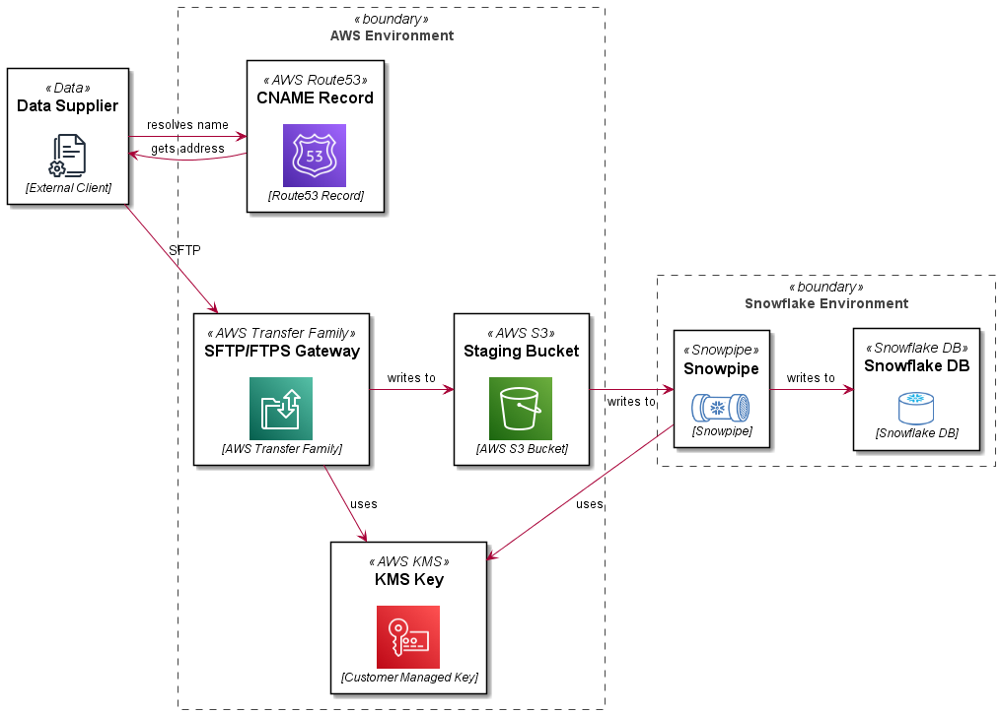

import Tabs from '@theme/Tabs';
import TabItem from '@theme/TabItem';
import Gist from 'react-gist';

> When you want the SFTP service without the SFTP Server.  

In implementing data platforms with external data providers, it is common to use a managed file transfer platform or an SFTP gateway as an entry point for providers to supply data to your system.  

Often in past implementations this would involve deploying a sever (typically a Linux VM) and provisioning and configuring an SFTP service.  If you wanted the data sent by clients to be copied to another storage medium (such as S3 or EFS) you would need to roll your own code or subscribe to a marketplace offering to do so.  

I recently trialled the [AWS Transfer Family SFTP gateway](https://docs.aws.amazon.com/transfer/index.html) offering from AWS and sharing my adventures here.  

## Architecture

In this reference architecture, we are deploying an SFTP service which uses a path in an S3 bucket as a user’s home directory.  Objects in the bucket are encrypted with a customer managed KMS key.  The SFTP server front end address is mapped to a vanity URL using Route53.  The bucket and path are integrated with a `STORAGE INTEGRATION`, `STAGE` and `PIPE` definition in Snowflake.  The Snowflake bits are covered in more detail in this blog: __[Automating Snowflake Role Based Storage Integration for AWS](automating-snowflake-role-based-storage-integration-for-aws)__.  This article just details the AWS Transfer Family SFTP setup.

<Tabs
  defaultValue="architecture"
  values={[
    { label: 'Architecture', value: 'architecture', },
    { label: 'PlantUML', value: 'plantuml', },
  ]
}>
<TabItem value="architecture">

[](images/aws-transfer-sftp-architecture.png) 

</TabItem>
<TabItem value="plantuml">

```
@startuml

skinparam rectangle<<boundary>> {
    Shadowing false
    StereotypeFontSize 0
    FontColor #444444
    BorderColor #444444
    BorderStyle dashed
}

skinparam defaultTextAlignment center

!$imgroot = "https://github.com/avensolutions/plantuml-cloud-image-library/raw/main/images"

!unquoted procedure $AwsS3($alias, $label, $techn, $descr="", $stereo="AWS S3")
    rectangle "==$label\n\n\n//<size:12>[$techn]</size>//" <<$stereo>> as $alias #white
!endprocedure

!unquoted procedure $Kms($alias, $label, $techn, $descr="", $stereo="AWS KMS")
    rectangle "==$label\n\n\n//<size:12>[$techn]</size>//" <<$stereo>> as $alias #white
!endprocedure

!unquoted procedure $Route53($alias, $label, $techn, $descr="", $stereo="AWS Route53")
    rectangle "==$label\n\n\n//<size:12>[$techn]</size>//" <<$stereo>> as $alias #white
!endprocedure

!unquoted procedure $AwsTransferFamily($alias, $label, $techn, $descr="", $stereo="AWS Transfer Family")
    rectangle "==$label\n\n\n//<size:12>[$techn]</size>//" <<$stereo>> as $alias #white
!endprocedure

!unquoted procedure $Data($alias, $label, $techn, $descr="", $stereo="Data")
    rectangle "==$label\n\n\n//<size:12>[$techn]</size>//" <<$stereo>> as $alias #white
!endprocedure

!unquoted procedure $Snowpipe($alias, $label, $techn, $descr="", $stereo="Snowpipe")
    rectangle "==$label\n\n\n//<size:12>[$techn]</size>//" <<$stereo>> as $alias #white
!endprocedure

!unquoted procedure $SnowflakeDb($alias, $label, $techn, $descr="", $stereo="Snowflake DB")
    rectangle "==$label\n\n\n//<size:12>[$techn]</size>//" <<$stereo>> as $alias #white
!endprocedure

$Data(supplier, Data Supplier, External Client)

rectangle "AWS Environment" <<boundary>> {
    $AwsTransferFamily(sftpgw, SFTP/FTPS Gateway, AWS Transfer Family)
    $AwsS3(s3staging, Staging Bucket, AWS S3 Bucket)
    $Kms(kms, KMS Key, Customer Managed Key)
    $Route53(r53, CNAME Record, Route53 Record)
}

rectangle "Snowflake Environment" <<boundary>> {
    $Snowpipe(snowpipe, Snowpipe, Snowpipe)
    $SnowflakeDb(db, Snowflake DB, Snowflake DB)
}

r53 -[hidden]D- sftpgw
supplier -> r53 : resolves name
r53 -> supplier : gets address
supplier -RIGHT-> sftpgw : SFTP
sftpgw -DOWN-> kms : uses
sftpgw -RIGHT-> s3staging: writes to
s3staging -RIGHT-> snowpipe: writes to
snowpipe -DOWN-> kms: uses
snowpipe -RIGHT-> db: writes to

@enduml
```
</TabItem>
</Tabs>

## Setup

The steps to set up this pattern are detailed below.  

:::info

This example uses the Jsonnet/CloudFormation pattern described in this article: __[Simplifying Large CloudFormation Templates using Jsonnet](simplifying-large-cloudformation-templates-using-jsonnet)__.  This is a useful pattern for breaking up a monolithic CloudFormation template at design time to more manageable resource scoped documents, then pre-processing these in a CI routine (GitLab CI, GitHub Actions, etc) to create a complete template.

:::

## Setup the Service

To setup the SFTP transfer service use the `AWS::Transfer::Server` resource type as shown below:  

<Gist id="c8b4ce8ab478715753aab73d478f4fcd" 
/>

:::note

Use the `tags` shown to display the custom hostname (used as a vanity url) in the Transfer UI in the AWS console.

:::

## Create the S3 Bucket

Create a bucket which will be used to store incoming files sent via SFTP.  

<Gist id="82eb106bc13f1a888f823cc71a7ff933" 
/>

:::note

This example logs to a logging bucket, not shown for brevity.

:::

## Create a Customer Managed KMS Key

Create a customer managed KMS key which will be used to encrypt data stored in the S3 bucket created in the previous step.  

<Gist id="2c563411442c4541584815389de8a3b5" 
/>

# Create an IAM role to access the bucket

Create an IAM role which will be assumed by the AWS Transfer Service to read and write to the S3 staging bucket.  

<Gist id="57e23a5c99c22f5550e99b086db5f9f1" 
/>

:::important

You must assign permissions to use the KMS key created previously, failure to do so will result in errors such as:

```
remote readdir(): Permission denied
```

:::

## User Directory Mappings

An SFTP users home directory is mapped to a path in your S3 bucket.  It is recommended to use the `LOGICAL` `HomeDirectoryType`.  This will prevent SFTP users from:

- seeing or being able to access other users home directories
- seeing the bucket name or paths in the bucket above their home directory

There are some trade offs for this which can make deployment a little more challenging but we will cover off the steps from here.

### Create a Scoped Down Policy

A "scoped down" policy prevents users from seeing or accessing objects in other users home directories.  This is a text file that will be sourced as a string into the `Policy` parameter of each SFTP user you create.

<Gist id="5e876bbf95b1b36355fa8af868572a26" 
/>

:::important

Using the `LOGICAL` `HomeDirectoryType` you don't have access to variables which represent the bucket, so this needs to be hard coded in the `policy.txt` document.  

Also if you are using a customer managed KMS key to encrypt the data in the bucket (which you should be), you need to add permissions to the key - which again cannot be represented by a variable.  

Failure to do so will result in errors when trying to `ls`, `put`, etc into the user's home directory such as:  

```
Couldn't read directory: Permission denied
Couldn't close file: Permission denied
```

Since these properties are unlikely to change for the lifetime of your service this should not be an issue.  

:::

### Create a user

Users are identified by a username and an SSH key, providing the public key to the server.  A sample user is shown here:  

<Gist id="1b946b07374b78e0aca380317729bfa9" 
/>

:::tip

As discussed previously, it is recommended to use `LOGICAL` home directory mappings, which prevents users from seeing information about the bucket or other directories on the SFTP server (including other users directories).

:::

## Create a Route 53 CNAME record

Ideally you want to use a vanity url for users to access your SFTP service, such as `sftp.yourcompany.com`.  This can be accomplished by using a Route 53 CNAME record as shown here:  

<Gist id="0098851edc8d60b45534f6b1134be8cd" 
/>

## Create some shared Tags

You would have noticed a shared `Tags` definition in many of the `libsonnet` files shown, an example `Tags` source file is shown here:  

<Gist id="8323d49f1045d2cd8c874d5a00e82a5e" 
/>

## Pull it all together!

Now that we have all of the input files, lets pull them all together in a `jsonnet` file, which will be preprocessed in a CI process to create a template we can deploy with AWS CloudFormation.  

<Gist id="f56065c075af9cc33853b0624f6ef636" 
/>

Your customers would now connect to your service using they private key which corresponds to the public key they supplied to you in one of the previous steps, for example:    

```bash
sftp -i mysftpkey jeffrey_aven@sftp.yourdomain.com
```

Add more users and enjoy!  

> if you have enjoyed this post, please consider [__buying me a coffee ☕__](https://www.buymeacoffee.com/jeffreyaven) to help me keep writing!