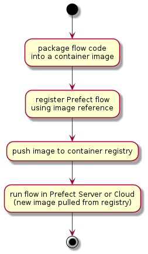

import Tabs from '@theme/Tabs';
import TabItem from '@theme/TabItem';

[Prefect.io](https://prefect.io) is a python based Data Engineering toolbox for building and
operating Data Pipelines.  Out of the box, Prefect provides an initial workflow for managing data
pipelines that results in a container image per data pipeline job.

The one-to-one relationship between data pipeline jobs and container images enables data engineers to
craft pipelines that are loosely coupled and don't require a shared runtime environment configuration.
However, as the number of data pipeline jobs grow the default container per job approach starts to
introduce workflow bottlenecks and lifecycle management overheads.  For example, in order
to update software components used by flows, such as upgrading the version of Prefect, all the data
pipeline job images have to be rebuilt and redeployed.  Additionally the container image per job workflow
introduces a wait time for data engineers to re-build data pipeline container images and test flows
centrally on Prefect Server or Prefect Cloud environment.

Fortunately, Prefect comes to its own rescue with the ability to open up the box, exposing the flexibility
in the underlying framework.

## Out of the box - Prefect DockerStorage
Out of the box, Prefect provides a simple workflow for defining and deploying data pipelines as container images.
After getting a first data pipeline running in a local environment, the attention turns to scaling up development
and deploying flows into a managed environment, using either the Prefect Cloud service or a Prefect Server.

Combining Prefect Cloud or Prefect Server with Kubernetes provides a flexible and scalable platform
solution for moving data pipelines into production.  There are a number of options for packaging
data pipeline flow code for execution on kubernetes clusters.  The Docker Storage option provides
the workflow for bundling the data pipeline job code into container images, enabling a common
controlled execution environment and well understood distribution mechanism.  The data pipeline runs as
a pod using the flow container image.

Prefect Docker Storage workflow steps for building and deploying data pipeline flows include:

<Tabs
  defaultValue="steps"
  values={[
    { label: 'Steps', value: 'steps', },
    { label: 'PlantUML', value: 'plantuml', },
  ]
}>
<TabItem value="steps">

[](images/image1.png) 

</TabItem>
<TabItem value="plantuml">

```
@startuml "docker-storage-workflow"
(*) --> "package flow code
into a container image" 
--> "register Prefect flow
using image reference"
--> "push image to container registry"
--> "run flow in Prefect Server or Cloud
(new image pulled from registry)"
--> (*)
@enduml
```
</TabItem>
</Tabs>

* packaging a flow (python code) as a serialised/pickled object into a container image
* registering the flow using the container image name
* pushing the container image to a container repository accessible from the kubernetes cluster
* running the flow by running an instance of the named container image as a kubernetes pod

This is relatively simple immutable workflow.  Each data pipeline flow version is effectively a unique and
self contained 'point-in-time' container image.  This initial workflow can also be extended to package
multiple related flows into a single container image, reducing the number of resulting container images.
But, as the number of data pipeline jobs grow, there issues of container image explosion and data engineering
productivity remain.

Using Prefect GitStorage for flows addresses both container image proliferation as well as development
bottlenecks.

## Prefect Git Storage
Prefect [Git Storage](https://docs.prefect.io/orchestration/flow_config/storage.html#git) provides a workflow for developing and deploying data pipelines directly from git repositories,
such as Gitlab or Github.  The data pipeline code (python) is pulled from the git repository on each invocation
with the ability to reference git branches and git tags.  This approach enables:
* reducing the number of container images to the number of different runtime configurations to be supported.
* improving the data engineering development cycle time by removing the need to build and push container images
on each code change.
* when combined with kubernetes Prefect Run Configs and Job templates, enables selection of specific runtime environment images

Note that the GitStorage option does required access from the runtime kubernetes cluster to the central git storage
service, e.g. gitlab, github, etc.

Prefect Git Storage workflow steps for 'building' and deploying data pipeline flows include:

<Tabs
  defaultValue="steps"
  values={[
    { label: 'Steps', value: 'steps', },
    { label: 'PlantUML', value: 'plantuml', },
  ]
}>
<TabItem value="steps">

[](images/image2.png) 

</TabItem>
<TabItem value="plantuml">

```
@startuml "git-storage-workflow"
(*) --> "push commited flow code
changes to git service"
--> "register PrefectFlow
using branch or tag reference"
--> "run flow in Prefect Server or Cloud
(code pulled from git service)"
--> (*)
@enduml
```
</TabItem>
</Tabs>

* pushing the committed code to the central git service
* registering the flow using the git repository url and branch or tag reference
* running the flow by pulling the reference code from the git service in a kubernetes pod

The container image build and push steps are removed from the developer feedback cycle time.
Depending on network bandwidth and image build times, this can save remove 5 to 10 minutes from each deployment iteration.

### Pushing the flow code
Once a set of changes to the data pipeline code has been committed, push to the central git service.
```bash
$ git commit
$ git push
```

### Registering the flow
The flow can be registered with Prefect using either a branch (HEAD or latest) or tag reference.  Assuming
a workflow with feature branches:
* feature branches: register the flow code using the feature branch.  This enables the latest version (HEAD)
of the pushed flow code to be used for execution.  It also enables skipping re-registration of the flow on new
changes as the HEAD of the branch is pulled on each flow run
* main line branches: register pinned versions of the flow using git tags.  This enables the use of a 
specific version of the flow code to be pulled on each flow run, regardless of future changes.

Determining the which reference to use:
```python
# using gitpython module to work with repo info
from git import Repo

# presidence for identifing where to find the flow code
# BUILD_TAG => GIT_BRANCH => active_branch
build_tag = branch_name = None
build_tag = os.getenv("BUILD_TAG", "")
if build_tag == "":
  branch_name = os.getenv("GIT_BRANCH", "")
  if branch_name == "":
    branch_name = str(Repo(os.getcwd()).active_branch)
```

Configuring Prefect Git storage:
```python
from prefect.storage import Git
import my_flows.hello_flow as flow # assuming flow is defined in ./my_flows/flow.py

# example using Gitlab
# either branch_name or tag must be empty string "" or None
storage = Git(
    repo_host=git_hostname,
    repo=repo_path,
    flow_path=f"{flow.__name__.replace('.','/')}.py",
    flow_name=flow.flow.name,
    branch_name=branch_name,
    tag=build_tag,
    git_token_secret_name=git_token_secret_name,
    git_token_username=git_token_username
)

storage.add_flow(flow.flow)
flow.flow.storage = storage

flow.flow.regsiter(build=False)
```

Once registered, the flow storage details can be viewed in the Prefect Server or Prefect Cloud UI.  In this example, Prefect will use the `HEAD` version of the `main` branch on each flow run.

[](images/flow-storage-details.png)

## Next Steps - Run Config
With Prefect Git Storage the runtime configuration and environment management is decoupled from the
data pipeline development workflow.  Unlike with Docker Storage, with Git Storage, the runtime
execution environment and data pipeline development workflows are defined and managed separately.
As an added benefit, the developer feedback loop cycle time is also reduced.

With the data engineering workflow addressed, the next step in scaling out the Prefect solution
turns to configuration and lifecycle management of the runtime environment for data pipelines.
Prefect Run Configs and Job templates provide the tools retaining the flexibility on container
image based runtime environments with improved manageability.  