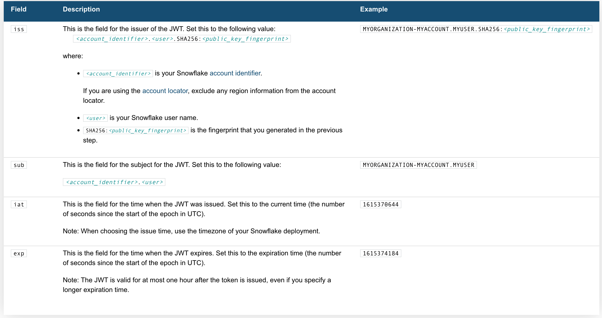

import Gist from 'react-gist';

This article demonstrates how to use the Snowflake REST API to retrieve data for a web application using TypeScript, in this case we are using keypair authentication with Snowflake.  

## Overview

Snowflake’s SQL API allows you to access snowflake objects using SQL via a REST API request, this allows for easy integration with your applications and deployment pipelines. You can use the API to execute most DDL and DML statements.  

There are some limitations you need to be aware of however, for example interactions with stages (using PUT and GET aren’t supported via the Snowflake API) or stored procedure operations (using CALL), you can read more on this [here](https://docs.snowflake.com/en/developer-guide/sql-api/intro.html#limitations-of-the-sql-api).  

## Endpoints

There are three endpoints provided:  

- `/api/v2/statements/`
- `/api/v2/statement/<statementHandle>`
- `/api/v2/statements/<statementHandle/cancel`

We will be looking at the first two in this article.  

## Authentication Methods

There are two types of Authentication methods for the API, __OAuth__ and __Key Pair__. For OAuth method, you can choose to use `X-Snowflake-Authorization-Token-Type` header, if this header is not present, Snowflake assumes that the token in the `Authorization` header is an OAuth token. For Key Pair method, the JWT token will be in the `Authorization` header as `Bearer <your token>`.  

Let’s walk through how to generate and use the JWT.  

## Generating the JWT

Here's whats needed:  

### the Code

<Gist id="6fbe63cace2ad993ac06b324954b7daa" 
/>

## Request Body

Now we need a request body:  

<Gist id="ae0ebbedf51f232e7147e72f11007b68" 
/>

## Submitting the Request

We will need to include the __region__ and __account identifier__, for instance if your account identifier includes a region (e.g. xy12345.us-east2.aws.snowflakecomputing.com).  

<Gist id="535123dda1536b5a48c6213470e83d6f" 
/>

## Response Handling

When making a `SELECT` query, there are three things worth noting:  
1.	`rowType` fields in the `resultSetMetaData` represent the columns
2.	data without column names is in the format of `string[][]`
3.	`partitionInfo` is an array of object representing different partitions

For more information see [Handling Responses from the SQL API - Snowflake Documentation](https://docs.snowflake.com/en/developer-guide/sql-api/handling-responses.html).  

### Parsing data

Here is a Typescript code snippet demonstrating parsing return data:  

<Gist id="d397621879b063ea0761233984aafe69" 
/>

### Handling multiple partitions

Large result sets are paginated into *partitions*, each partition is a set of rows.

:::note

Note that the pages (referred to as partitions) are __NOT__ based on row count, instead they are based on the compressed batch size, so they will not be uniform in terms of the number of rows.

:::

To get a partition, send a `GET` request with Url `https://<accountIdentifier>.snowflakecomputing.com/api/v2/statements/?partition=<partitionId>`.  

<Gist id="7f2b0443a9ca5e8284b987a9e84ca301" 
/>

Thanks!  

