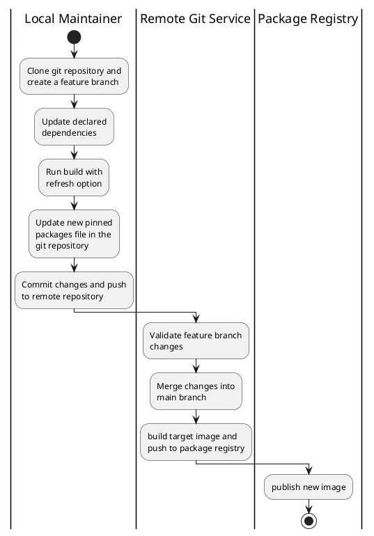
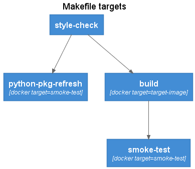

import Tabs from '@theme/Tabs';
import TabItem from '@theme/TabItem';

Container images provide an ideal software packaging solution for DataOps and python based data pipeline workloads.  Containers enable Data Scientists and Data Engineers to incorporate the latest packages and libraries without the issues associated with introducing breaking changes into shared environments.  A Data Engineer or Data Scienctist can quickly release new functionality with the best tools available.  

Container images provide safer developer environments but as the number of container images used for production workloads grow, a maintenance challenge can emerge.  Whether using [pip](https://pypi.org/project/pip) or [poetry](https://python-poetry.org/) to manage python packages and dependencies, updating a container definition requires edits to the explicit package versions as well as to the pinned or locked versions of the package dependencies. This process can be error prone without automation and a repeatable CICD workflow.  

A workflow pattern based on [docker buildkit](https://docs.docker.com/develop/develop-images/build_enhancements/) / [moby buildkit](https://github.com/moby/buildkit) multi-stage builds provides an approach that maintains all the build specifications in a single `Dockerfile`, while build tools like `make` provide a simple and consistent interface into the container build stages.  The data pipeline challenges addresses with a multi-stage build pattern include:  

- automating lifecycle management of the Python packages used by data pipelines
- integrating smoke testing of container images to weed out compatibility issues early
- simplifying the developer experience with tools like `make` that can be used both locally and in CI/CD pipelines

The `Dockerfile` contains the definitions of the different target build stages and order of execution from one stage to the next.  The `Makefile` wraps the Dockerfile build targets into a standard set of workflow activities, following a similar to `$ config && make && make install` 

## The DataOps Container Lifecycle Workflow

A typical dataops/gitops style workflow for maintaining container images includes actions in the local environment to define the required packages and produce the pinned dependency `poetry.lock` file or `requirements.txt` packages list containing the full set of pinned dependent packages.  

Given and existing project in a remote git repository with a CI/CD pipeline defined, the following workflow would be used to update package versions and dependencies:  

<Tabs
  defaultValue="flow"
  values={[
    { label: 'Workflow', value: 'flow', },
    { label: 'PlantUML', value: 'plantuml', },
  ]
}>
<TabItem value="flow">

[](images/multi-stage-build-workflow.png) 

</TabItem>
<TabItem value="plantuml">



</TabItem>
</Tabs>

The image maintainer selects the packages to update or refresh using a local development environment, working from a feature branch.  This includes performing an image smoke-test to validate the changes within the container image.  

Once refreshed image has been validated, the lock file or full pinned package list is commited back to the repository and pushed to the remote repository.  The CI/CD pipeline performs a trial build and conducts smoke testing.  On merge into the main branch, the target image is built, re-validated, and pushed to the container image registry.  

The multi-stage build pattern can support both defining both the declared packages for an environment as well as the dependent packages, but `poetry` splits the two into distinct files, a `pyproject.toml` file containing the declated packages and a `poetry.lock` file that contains the full set of declared and dependent packages, including pinned versions.  `pip` supports loading packages from different files, but requires a convention for which requirements file contains the declared packages and while contains the full set of pinned package versions produced by `pip freeze`.  The example code repo contains examples using both `pip` and `poetry`.  

The following example uses [poetry](https://python-poetry.org/) in a `python:3.8` base image to illustrate managing the dependencies and version pinning of python packages.  

## Multi-stage Dockerfile

The `Dockerfile` defines the build stages used for both local refresh and by the CICD pipelines to build the target image.  

<Tabs
  defaultValue="stages"
  values={[
    { label: 'Stages', value: 'stages', },
    { label: 'PlantUML', value: 'plantuml', },
  ]
}>
<TabItem value="stages">

[](images/Dockerfile-stages.png) 

</TabItem>
<TabItem value="plantuml">

```plantuml
@startuml Dockerfile stages
!define C4_PLANTUML https://raw.githubusercontent.com/plantuml-stdlib/C4-PlantUML/master
!include C4_PLANTUML/C4_Component.puml

HIDE_STEREOTYPE()
UpdateElementStyle(Container, $bgColor=green)

Title: Docker build stages
Container(pre, base-pre-pkg,)
Container(refresh, python-pkg-refresh,)
Container(pinned, python-pkg-pinned,)
Container(post, base-post-pkg,)
Container(smoke, smoke-test,)
Container(target, target-image,)

Rel(pre, refresh, "refresh")
Rel(pre, pinned, "pinned")
Rel(refresh, post, " ")
Rel(pinned, post, " ")
Rel(post, smoke, "QA")
Rel(post, target, "artefact")
@enduml
```

</TabItem>
</Tabs>

The Dockerfile makes use of the docker build arguments feature to pass in whether the build should refresh package versions or build the image from pinned packages.  

### Build Stage: base-pre-pkg

Any image setup and pre-python package installation steps.  For `poetry`, this includes setting the config option to skip the creation of a virtual environment as the container already provides the required isolation.  

```Dockerfile
ARG PYTHON_PKG_VERSIONS=pinned
FROM python:3.8 as base-pre-pkg

RUN install -d /src && \
    pip install --no-cache-dir poetry==1.1.13 && \
    poetry config virtualenvs.create false
WORKDIR /src
```

### Build Stage: python-pkg-refresh

The steps to generate a `poetry.lock` file containing the pinned package versions.  

```Dockerfile
FROM base-pre-pkg as python-pkg-refresh
COPY pyproject.toml poetry.lock /src/
RUN poetry update && \
    poetry install 
```

### Build Stage: python-pkg-pinned

The steps to install packages using the pinned package versions.

```Dockerfile
FROM base-pre-pkg as python-pkg-pinned
COPY pyproject.toml poetry.lock /src/
RUN poetry install 
```

### Build Stage: base-post-pkg

A consolidation build target that can refer to either the python-pkg-refresh or the python-pkg-pinned stages, depending on the docker build argument and includes any post-package installation steps.  

```Dockerfile
FROM python-pkg-${PYTHON_PKG_VERSIONS} as base-post-pkg
```

### Build Stage: smoke-test

Simple smoke tests and validation commands to validate the built image.  

```Dockerfile
FROM base-post-pkg as smoke-test
WORKDIR /src
COPY tests/ ./tests
RUN poetry --version && \
    python ./tests/module_smoke_test.py
```

### Build Stage: target-image

The final build target container image.  Listing the `target-image` as the last stage in the `Dockerfile` has the effect of also making this the default build target.  

```Dockerfile
FROM base-post-pkg as target-image
```

## Multi-stage Makefile

The Makefile provides a workflow oriented wrapper over the Dockerfile build stage targets.  The Makefile targets can be executed both in a local development environment as well as via a CICD pipeline.  The `Makefile` includes several variables that can either be run using default values, or overridden by the CI/CD pipeline.  

<Tabs
  defaultValue="targets"
  values={[
    { label: 'Targets', value: 'targets', },
    { label: 'PlantUML', value: 'plantuml', },
  ]
}>
<TabItem value="targets">

[](images/Makefile-targets.png) 

</TabItem>
<TabItem value="plantuml">

```plantuml
@startuml Makefile targets
!define C4_PLANTUML https://raw.githubusercontent.com/plantuml-stdlib/C4-PlantUML/master
!include C4_PLANTUML/C4_Component.puml

HIDE_STEREOTYPE()

Title: Makefile targets
Container(style, style-check,)
Container(refresh, python-pkg-refresh, "docker target=smoke-test")
Container(smoke, smoke-test, "docker target=smoke-test")
Container(build, build, "docker target=target-image")

Rel(style, refresh, " ")
Rel(style, build, " ")
Rel(build, smoke, " ")

@enduml
```

</TabItem>
</Tabs>

## Make Target: style-check

Linting and style checking of source code.  Can include both application code as well as the Dockerfile itself using tools such as [hadolint](https://github.com/hadolint/hadolint).  

```Makefile
style-check:
	hadolint ./Dockerfile
```

## Make Target: python-pkg-refresh

The `python-pkg-refresh` target builds a version of the target image with refreshed package versions. A temporary container instance is created from the target image and the `poetry.lock` file is copied into the local file system. The `smoke-test` docker build target is used to ensure image validation is also performed.
The temporary container as well as the package refresh image are removed after the build.  

```Makefile
python-pkg-refresh:
	@echo ">> Update python packages in container image"
	docker build ${DOCKER_BUILD_ARGS} \
	       --target smoke-test \
		   --build-arg PYTHON_PKG_VERSIONS=refresh \
		   --tag ${TARGET_IMAGE_NAME}:$@ .
	@echo ">> Copy the new poetry.lock file with updated package versions"
	docker create --name ${TARGET_IMAGE_NAME}-$@ ${TARGET_IMAGE_NAME}:$@
	docker cp ${TARGET_IMAGE_NAME}-$@:/src/poetry.lock .
	@echo ">> Clean working container and refresh image"
	docker rm ${TARGET_IMAGE_NAME}-$@
	docker rmi ${TARGET_IMAGE_NAME}:$@
```

### Make Target: build

The standard build target using pinned python package versions.  

```Makefile
build:
	docker build ${DOCKER_BUILD_ARGS} \
	       --target target-image \
		   --tag ${TARGET_IMAGE_NAME}:${BUILD_TAG} .

```

### Make Target: smoke-test

Builds an image and peforms smoke testing.  The smoke-testing image is removed after the build.  

```Makefile
smoke-test:
	docker build ${DOCKER_BUILD_ARGS} \
	       --target smoke-test \
		   --tag ${TARGET_IMAGE_NAME}:$@ .
	docker rmi ${TARGET_IMAGE_NAME}:$@
```

## Conclusion

The toolchain combination of multi-stage container image builds with `make` provides a codified method for the lifecycle management of the containers used in data science and data engineering workloads.  

The maintainer:  

```bash
git checkout -b my-refresh-feature
make python-pkg-refresh
make smoke-test
git add pyproject.toml poetry.lock
git commit -m "python package versions updated"
git push
```

The CICD pipeline:  

```bash
make build
make smoke-test
docker push <target-image>:<build-tag>
```

:::info

You can find the complete source code for this article at [https://gitlab.com/datwiz/multistage-pipeline-image-builds](https://gitlab.com/datwiz/multistage-pipeline-image-builds)

:::