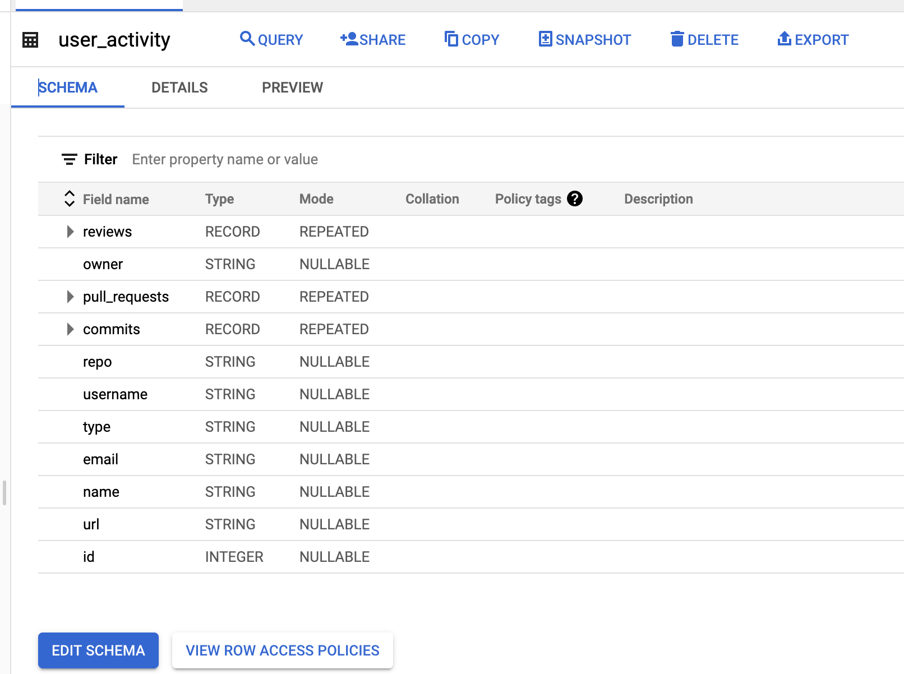

import Gist from 'react-gist';

It is common to have a remote and dispersed team these days. As face to face meetings are less common and with geographically dispersed development teams not possible, it is challenging to have a clear picture of where your team is.  

GitHub provides useful data to help us understand your development team's workload and progress.  StackQL has an official GitHub provider which allows you to access this data using SQL. 

:::info

StackQL is an open source project which enables you to query, analyze and interact with cloud and SaaS provider resources using SQL, see [__stackql.io__](https://stackql.io/) 

:::

In this example we will use the [`pystackql`](https://github.com/stackql/pystackql) Python package (Python wrapper for StackQL) along with a Jupyter Notebook to retrieve data from GitHub using SQL, then sink the data into a cloud native data warehouse for long term storage and analytics at scale, in this example we have used [BigQuery](https://cloud.google.com/bigquery).  

## Step by Step Guide

This guide will walk you through the steps involved in capturing and analyzing developer data using StackQL, Python, Jupyter and BigQuery.  

### 1. Create GitHub Personal Access Token

You will need to create a Personal Access Token in GitHub for a user which has access to the org or orgs in GitHub you will be analyzing.  Follow [this guide](https://docs.github.com/en/enterprise-server@3.4/authentication/keeping-your-account-and-data-secure/creating-a-personal-access-token) to create your GitHub token and store it somewhere safe.  

### 2. Setup your Jupyter Notebook
You need to set up your Jupyter environment, you can either use the Docker, see [stackql/stackql-jupyter-demo](https://github.com/stackql/stackql-jupyter-demo) or:  
1. [Create your Jupyter project](https://jupyter.org/try)
2. [Download and install StackQL](https://stackql.io/downloads)
3. [Clone the pystackql repo](https://github.com/stackql/pystackql)

### 3. Setup StackQL Authentication to GitHub

You can find instructions on how to use your personal access token to authenticate to GitHub [here](https://registry.stackql.io/providers/github/#authentication).  The following example shows how to do this in a Jupyter notebook cell using `pystackql`.

<Gist id="18e9de9c1a184a5d3e7d623d4681ceb3"
/>

### 4. Retrieve data

Next, we will use StackQL SQL queries to get commits, pull requests and pull request reviews, then we will aggregate by usernames of contributors. You can use `JOIN` semantics in StackQL to do this as well.  

#### Get Contributors, Commits, Pull Requests and Reviews

In the following cell we will query data from GitHub using StackQL:  

<Gist id="29da46f9428ea7c2dcb53fdded019785"
/>

#### Aggregate Data By Username

Now we will aggregate the data by each contributor, see the following example:

<Gist id="4414fcf6bdd6aff4d227c07b461887e6"
/>

### 5. Store the Data in BigQuery
After the transformation of data, we will then upload it to BigQuery.  First, we will store the data as a new line delimited `json` file, making the uploading process much easier and handling the nested schema better, as shown in the following cell:  

<Gist id="34ac71d46030693bbaa3c7c4309855f5"
/>

Now we can see the table on BigQuery as shown here:  

From here you can use the same process to append data to the table and use BigQuery to perform analytics at scale on the data.

:::info

The complete notebook for this article can be accessed at [FabioYyc/stackql-github-notebook-bq](https://github.com/FabioYyc/stackql-github-notebook-bq) 

:::

