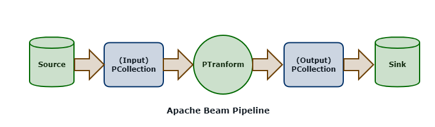

Apache Beam is an open-source project which provides a unified programming model for Batch and Streaming data pipelines.  

__B__(*atch*) __+__ *str*(__EAM__) __=>__ __BEAM__  

## Beam SDK and Execution Framework

Beam SDKs allow you to define __Pipelines__ (in languages such as Java or Python).  A pipeline is essentially a graph (a DAG - Directed Acyclic Graph) of nodes that represent transformation steps.  

Pipelines can then be executed on a backend service (such as your local machine, Apache Spark, or Google Cloud Dataflow) using __Runners__.  For instance, to run a pipeline locally, you would use the DirectRunner; to run a pipeline on Google Cloud Dataflow you would use the DataflowRunner runner.  

## Beam Programming Model

The __PCollection__ is the most atomic data unit in the Beam programming model, akin to the RDD in the Apache Spark core API; it is a representation of an immutable collection of items that is physically broken down into __bundles__ (subsets of elements for parallelization).  

PCollections can be *bounded* (which is a batch processing pattern) or *unbounded* (which is a stream processing pattern).  

A __PTransform__ is an operator that takes a PCollection as an input and outputs a new PCollection with transforms applied.  This is the same coarse-grained transformation pattern employed by Spark.  

## Beam DSL

The Beam DSL is a set of higher-order functions that can be used to construct pipelines.  These functions are used to construct the graph of nodes that represent the pipeline.  

### Map, FlatMap and Filter

The basic __Map__, __FlatMap__ and __Filter__ functions in the Beam API work similarly to their namesakes in the Spark Core API.  The Map and FlatMap functions are higher-order functions (that is, functions that have arguments of other functions) that operate on each element in a collection, emitting an output element for each input element.  The Filter function can be used to only emit elements from an input PCollection that satisfy a given expression.  

### ParDo and DoFn

__ParDo__ is a wrapper function for parallel execution of a user-defined function called a __DoFn__ ("do function"), ParDo's and DoFn's are used when the basic Map and FlatMap operators are not enough.  DoFns are executed in parallel on a PCollection and can be used for computational transformations or transformations other than 1:1 between inputs and outputs.  

Think of these as user-defined functions to operate on a PCollection in parallel.  

### GroupByKey, CombineByKey

__GroupByKey__ and __CombineByKey__ are operators that group data (key-value pairs) by the key for each element.  This is typically a precursor to some aggregate operation (such as a count or sum operation).  

### CoGroupByKey and Flatten

__CoGroupByKey__ is akin to a `JOIN` operation in SQL (by the key for each element in two PCollections).  __Flatten__ is akin to a `UNION` in SQL.  

## Side Inputs

__Side Inputs__ can be used with ParDo and DoFn to provide additional data, which can be used to enrich your output PCollection, or utilized within the logic of your DoFn.  

## Sources, Sinks and Connectors

__Sources__ represent where data is read into an Apache Beam pipeline; __sinks__ represent destinations where data is written out from pipelines.  A Beam pipeline will contain one or more sources and sinks.  

Sources can be bounded (for batch processing) or unbounded for stream processing.  

__Connectors__ can be source connectors or sink connectors to read from or write to the various sources and targets used in a Beam pipeline.  Examples include FileIO and TextIO for working with files or text data, BigQueryIO for reading or writing into BigQuery, PubSubIO for reading and writing messages into Google PubSub, and much more.  

## Streaming and Unbounded PCollections

Streaming data sources are represented by Unbounded PCollections.  Unbounded PCollections support windowing operations using __Fixed Windows__, __Sliding Windows__, or __Session__ Windows.  __Watermarks__ are used to allow for late-arriving data to be processed within its associated time window, and __Triggers__ can be used to control the processing of windowed batches of data.   

## Templates 

Beam templates enable the reusability of pipelines, converting compile-time pipeline parameters to run-time arguments.  Jobs (invocations of pipelines) can be launched from templates.  

__Templates__ include classic templates, where the graph for the pipeline is built (compile-time) with the template, flex templates where the pipeline graph is created when the template is launched (runtime).  

In addition, Google provides several templates with Cloud Dataflow (Google-provided templates), allowing you to launch routine jobs without writing any code.  

Google-provided templates are available for batch, streaming, and utility pipelines, for example:  

- Kafka to BigQuery
- Pub/Sub Topic to BigQuery
- Text Files on Cloud Storage to BigQuery
- Text Files on Cloud Storage to Cloud Spanner
- Bulk Compress or Decompress Files on Cloud Storage
- and more

5 minutes is up!  I hope you enjoyed this quick introduction to Apache Beam.  If you want to learn more, check out the [Apache Beam documentation](https://beam.apache.org/documentation/).  

> if you have enjoyed this post, please consider [__buying me a coffee ☕__](https://www.buymeacoffee.com/jeffreyaven) to help me keep writing!