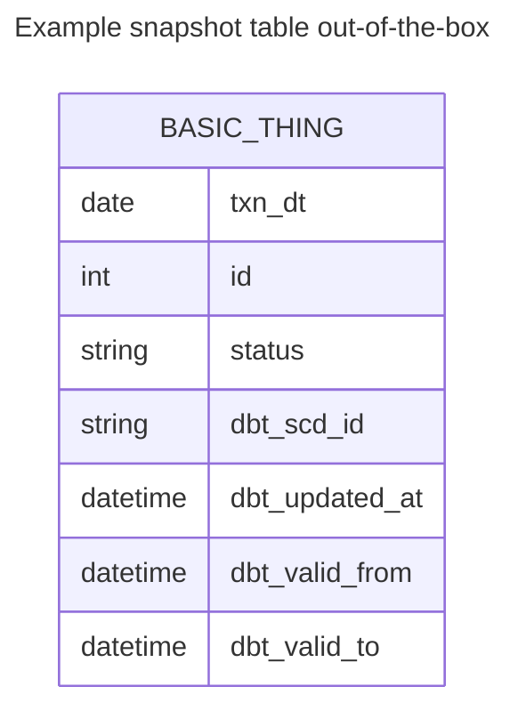
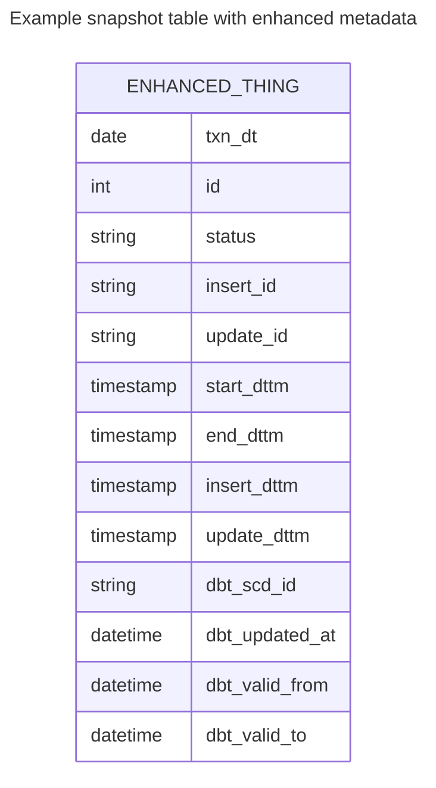

import Gist from 'react-gist';

The out-of-the-box [__dbt snapshots__](https://docs.getdbt.com/docs/build/snapshots) provide change data capture (CDC) capability for tracking the changes to data in your data lake or data warehouse.  The dbt snapshot metadata columns enable a view of change to data - which records 
have been updated and when.   However, the dbt snapshot metadata doesn't provide a view of the processing audit - which process
or job was responsible for the changes.  The ability to audit at the processing level requires additional operational metadata.

The out-of-the-box `dbt snapshot` strategies (rules for detecting changes) likely provide the desired logic for detecting and managing data change.
No change to the snapshot strategies or snapshot pipeline processing is desired, but additional operational metadata
fields must be set and carried through with the data.

:::note

The full source code for this article is available at [__github.com/datwiz/dbt-snapshot-metadata__](https://github.com/datwiz/dbt-snapshot-metadata).

:::

## Objectives
Both operational and governance requirements can drive the need for greater fidelity of operational metadata.
Example considerations could include:
* use of the out-of-the-box `dbt snapshot` logic and strategies for Change Data Capture (CDC)
* addition of operational metadata fields to snapshot tables with processing details for ops support and audit
  - when new records are inserted, add operational processing metadata information to each record
  - when existing records are closed or end-dated, update operational metadata fields with processing metadata







Aside from including a new `process_id` value in records, these enhancements don't add further information to the
table.  Instead they are a materialization of the operational data that is easier to access.  The same information
could be derived from standard dbt metadata fields but would require a more complex SQL statement that includes
a left outer self-join.  As with any materialization decision, there is a trade-off between ease of access
vs. additional storage requirements.

### `NULL` vs High-End Date/Timestamp
In addition to the ops support and audit requirements, there can also be a legacy migration complication
related to how open records (the most current version of the record) are represented in snapshots.  dbt snapshots
represent open records using `NULL` values for `dbt_valid_to` fields.
In legacy data lakes or data warehouses, the open records often are identified using a
well-known high value for the effective end date/timestamp, such as `9999-12-31` or `9999-12-31 23:59:59`.  Adding
additional snapshot metadata columns enables a legacy view of record changes without having to alter the
`dbt snapshot` strategy or processing logic.  

:::tip

Transitioning to `NULL` values for the `valid_to` end date/timestamp value for open records
is highly recommended, especially when porting to a new database platform or cloud-based service.  On-premise
legacy database platforms often use `TIMESTAMP` values without including timezones or timezone offsets, relying on a system-wide default timezone setting.
Different databases may also have extra millisecond precision for `TIMESTAMP` columns.
Precision and timezone treatment can cause unexpected issues when migrating to a new database platform.

For example, in BigQuery
```
datetime('9999-12-31 23:59:59.999999', 'Australia/Melbourne')
```
will generate an invalid value error, while
```
timestamp('9999-12-31 23:59:59.999999', 'Australia/Melbourne')
```
will silently convert the localised timestamp to UTC `9999-12-31 23:59:59.999999+00`

The use of `NULL` values for open records/`valid_to` fields avoids this risk of subtle breakage.

:::

## Enhancing the default Snapshot
Modify the default dbt snapshot behavior by overriding the [dbt snapshot materialization macros](https://github.com/dbt-labs/dbt-core/tree/main/core/dbt/include/global_project/macros/materializations/snapshots).
dbt enbles macros to be overridden using the following resolution or search order:
1.  locally defined macros in the project's ./macros directory
2.  macros defined in additional dbt packages included in the project `packages.yml` file
3.  dbt adaptor-specific macros
3.  dbt provided default macros

To inject additional snapshot metadata fields into snapshot tables override the following two default macros:
* `default__build_snapshot_table()` creates the snapshot table on the first run
* `default__snapshot_staging_table()` stages in the inserts and updates to be applied to the snapshot table

To update fields on snapshot update, override the following default macro:
* `default__snapshot_merge_sql()` performs the MERGE/UPSERT 

Note that if the dbt database adaptor implements adaptor-specific versions of these macros, then update
the adaptor-specific macro accordingly.  For example the [dbt-spark](https://github.com/dbt-labs/dbt-spark/blob/main/dbt/include/spark/macros/materializations/snapshot.sql) adaptor overrides the
dbt `default__snapshot_merge_sql()` as `spark__snapshot_merge_sql()`.

### `build_snapshot_table()`
The [default__build_snapshot_table()](https://github.com/datwiz/dbt-snapshot-metadata/tree/main/dbt_snapshot_ops_metadata/macros/default__build_snapshot_table.sql) macro is called on the first `dbt snapshot` invocation.  This
macro defines the content to include in the `CREATE TABLE` statement.  The following example adds 
process id's using the dbt `invocation_id` and additional timestamp fields, including use of the
well-known high timestamp value for open records.  This value is defined as the variable `default_high_dttm`
in the `dbt_project.yml` file.  The `dbt snapshot` strategy processing uses the unmodified
standard dbt columns, so modification to change detection logic is not required.

<Gist id="750d131f1e4c3891d1a358b3e655574e"
/>

### `snapshot_staging_table()`
The [default__snapshot_staging_table()](https://github.com/datwiz/dbt-snapshot-metadata/tree/main/dbt_snapshot_ops_metadata/macros/default__snapshot_staging_table.sql) macro is called on subsequent `dbt snapshot` invocations.  This macro
defines the content in the `MERGE` statement for inserts and updates.  The following example adds
the additional operational metadata fields to the `insertions` common table expression (CTE) and the `updates` (CTE).
The dbt `invocation_id` is used again as the `process_id` for inserts on new records and updates that
close existing records.

<Gist id="e4601e9d2cb4a1186390d47834d570f8"
/>

Note that the `deletes` CTE has not been updated with the additional fields.  In scenarios that use the 
hard deletes feature, the `deletes` CTE would need to be modified as well.

### `snapshot_merge_sql()`
The [default__snapshot_merge_sql()](https://github.com/datwiz/dbt-snapshot-metadata/tree/main/dbt_snapshot_ops_metadata/macros/default__snapshot_merge_sql.sql) macro is called to perform the `MERGE`/`UPSERT` into the target snapshot table.  This macro defines how fields in the records being closed should be updated.  The `update set`
section of the `MERGE` statement defines the updated columns and values.

<Gist id="d8b3180a11e7cf334ef7be3ac75429d9"
/>

## Conclusion
Overriding the default dbt snapshot macros enables the injection and updating of additional operational
metadata in snapshot tables.  Fields can be added such that the provided dbt logic and snapshot
strategy processing is still applied. Still, the resulting snapshot tables contain the columns required
for the data lake or data warehouse.

The sample dbt project in [__datwiz/dbt-snapshot-metadata/tree/main/dbt_snapshot_ops_metadata__](https://github.com/datwiz/dbt-snapshot-metadata/tree/main/dbt_snapshot_ops_metadata) contains an implementation of the snapshot customization.