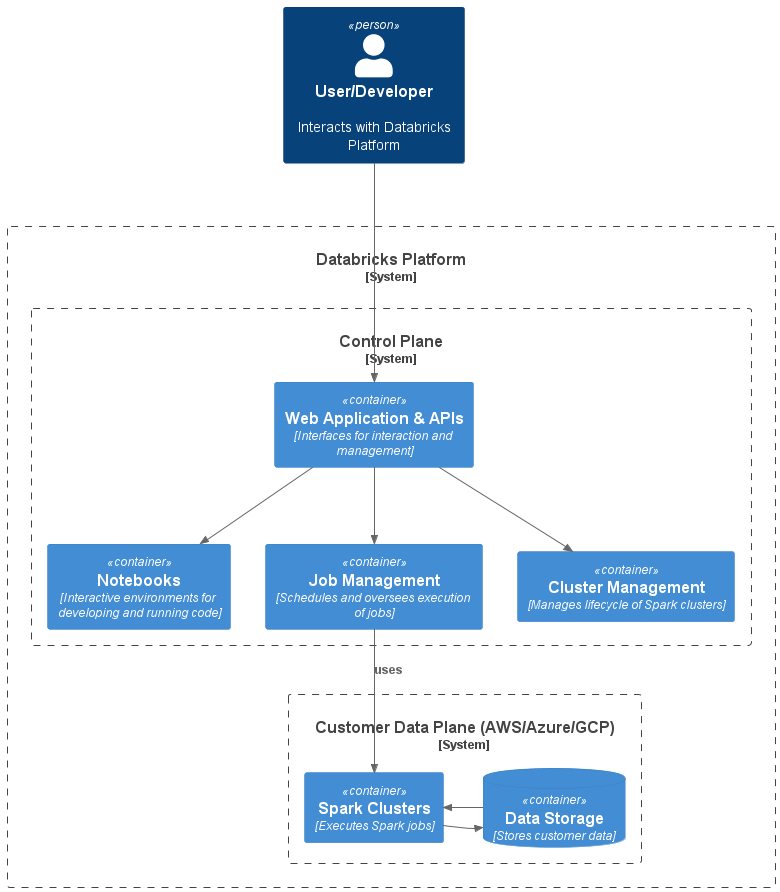

[__Databricks__](https://databricks.com/) is a unified data management and analytics platform built by the creators of Apache Spark. It provides a collaborative environment for data scientists, engineers, and business analysts to work together. This brief overview will walk you through the basics of Databricks.

## Summary

Databricks is a cloud-based "as-a-Service" platform for data management and analytics powered by Apache Spark. It enables organizations to deploy scalable, high-performance analytics workloads against large-scale datasets in their cloud environments. Databricks also supports multiple languages (SQL, Python, R, Scala, and Java), interactive notebooks and collaborative features, job scheduling, and more. The Databricks platform supports batch and stream processing and analytics, integrating with various data sources and formats.  

## Architecture

The Databricks architecture consists of two main components: the __Control Plane__ and the __Data Plane__.  

The user interfaces and APIs are located in the  __Control Plane__. It's where users write code in notebooks, manage clusters, and schedule jobs. The Control Plane does not handle customer data directly.  

The __Data Plane__ - deployed in the customer's cloud environment and managed by the Control Plane - is where compute clusters (Apache Spark clusters) and storage resources are located. Spark jobs run in the Data Plane to process a customer's data.  

This architecture enables a clear separation of responsibilities and increases overall system security. By keeping customer data within the Data Plane, Databricks ensures that sensitive information remains in the customer's environment and control.  

Databricks supports a multi-cloud architecture, allowing customers to choose between AWS, Azure, and Google Cloud as their preferred environment for the Data Plane.  

## Clusters

Databricks allows you to create Spark clusters required to execute notebook code. Clusters can be __Job Clusters__ used mainly for non-interactive or scheduled workloads, or __All Purpose Clusters__ which are mainly used for ad-hoc, interactive analysis operations. All-Purpose Clusters are shared clusters that multiple users can run commands on simultaneously. The Databricks Control Plane provides cluster automation, scaling, and collaboration capabilities.

## Workspaces and Notebooks

The __Workspace__ is a personalized space where users can create notebooks, import libraries, and run jobs. __Notebooks__ are documents combining code execution, visualizations, and narrative. They support Python, R, Scala, and SQL. Databricks notebooks are similar to popular notebook environments such as Jupyter Notebooks and Apache Zeppelin Notebooks.  

## Databricks File System (DBFS)
DBFS is an abstraction layer on top of scalable object storage and offers the benefits of distributed storage without needing local file I/O. DBFS can be used as a source or target for jobs, and Databricks offers multiple utilities for working with DBFS.  

## Delta Lake and Lakehouse

[__Delta Lake__](https://delta.io/) is an open-source project providing ACID transactions, scalable metadata handling, and unifying streaming and batch data processing on top of your existing data lake. It brings reliability to data lakes, and it is fully compatible with Apache Spark APIs.  

A __Lakehouse__ is a new kind of data management paradigm combining the benefits of data warehouses and data lakes. It provides a data warehouse's reliability, performance, and transactional capabilities with schema-on-read flexibility and low-cost data lake storage.

## Delta Live Tables
__Delta Live Tables__ represent the state of a streaming dataset, views, or materialized views. Delta Live Tables provide improved data availability, quality, and reliability.

## Medallion Architecture

The __Medallion Architecture__ is a methodology for organizing data in your data lake. This is not a new concept; it has been around for a while in the field of data engineering. The names for the layers might differ (like *Raw*, *Clean*, and *Refined* etc), but the concept remains the same. It provides a guideline to systematically organize the data transformation process, with a clear separation between stages.  

The Medallion Architecture is named after the 'bronze', 'silver', and 'gold' stages of refining raw material.  

__Bronze__ tables, also known as raw tables, store the raw data ingested from various sources. This data is in its original form and hasn't undergone any transformation or cleaning.  

__Silver__ tables contain cleansed and enriched data. This results from applying transformations, such as deduplication and schema normalization, to the bronze data.  

__Gold__ tables hold business-level aggregates often used for reporting and dashboarding. This might be like daily active users or revenue by geography and product.  

This architecture aims to separate data processing into logical layers and allow different teams to work on each layer independently. The Databricks Lakehouse is designed to support this methodology.

> if you have enjoyed this post, please consider [__buying me a coffee ☕__](https://www.buymeacoffee.com/jeffreyaven) to help me keep writing!